# Day 15 — Spark Execution Plans & Performance

## Learning Objectives

By the end of Day 15, understand:

- `groupBy()` execution
- `HashAggregate`
- `Exchange` and shuffle
- `repartition()` vs `coalesce()`
- `RoundRobinPartitioning`
- `HashPartitioning`
- WholeStageCodegen
- Adaptive Query Execution (AQE)
- `explain()` and Spark UI
- Jobs, stages, and tasks
- Shuffle Read / Shuffle Write
- End-to-end Spark performance analysis

---

# Day 15 Structure

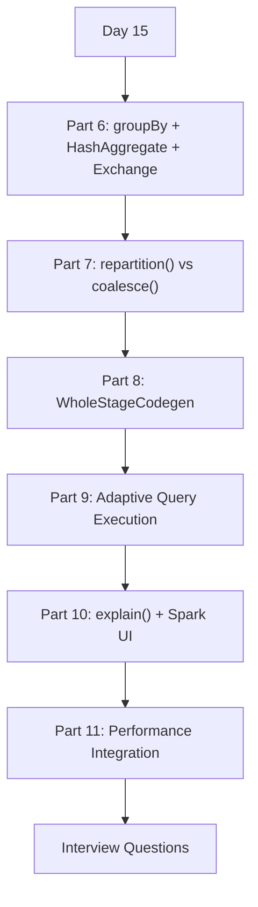

---

# Part 6 — groupBy + HashAggregate + Exchange

## 6.1 Basic Example

```python
grouped_df = df.groupBy("department").count()

grouped_df.show()
```

The same department can exist in multiple input partitions.

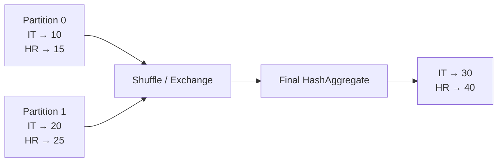

---

## 6.2 Complete Aggregation Flow

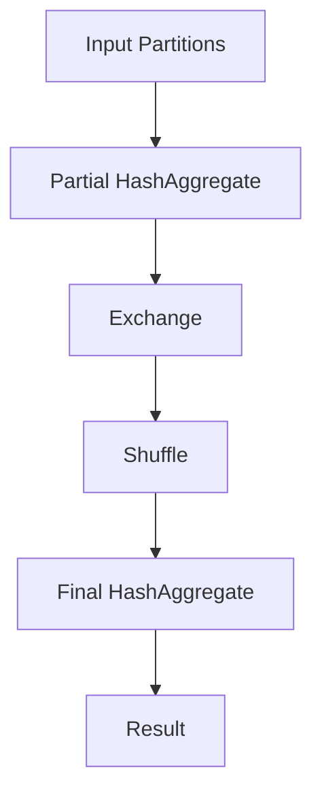

---

## 6.3 Why Partial Aggregation?

Instead of shuffling every row:

```text
IT
IT
IT
HR
HR
```

Spark can first calculate:

```text
IT → 3
HR → 2
```

Then shuffle the smaller intermediate result.

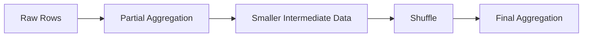

---

## 6.4 Exchange

`Exchange` represents a redistribution/shuffle boundary.

Example:

```text
Exchange hashpartitioning(department, 200)
```

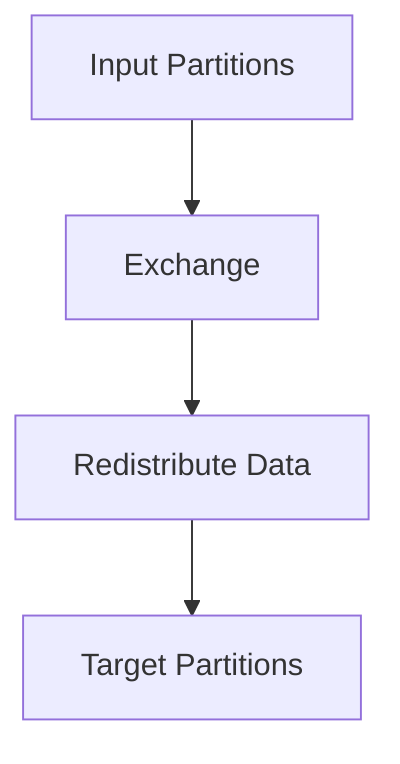

Think:

> **Exchange = Spark needs to redistribute data between partitions.**

---

# Part 7 — repartition() vs coalesce()

## 7.1 repartition()

```python
df = df.repartition(4)
```

Conceptually:

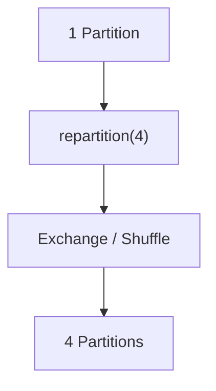

Physical plan:

```text
Exchange RoundRobinPartitioning(4)
```

---

## 7.2 RoundRobinPartitioning

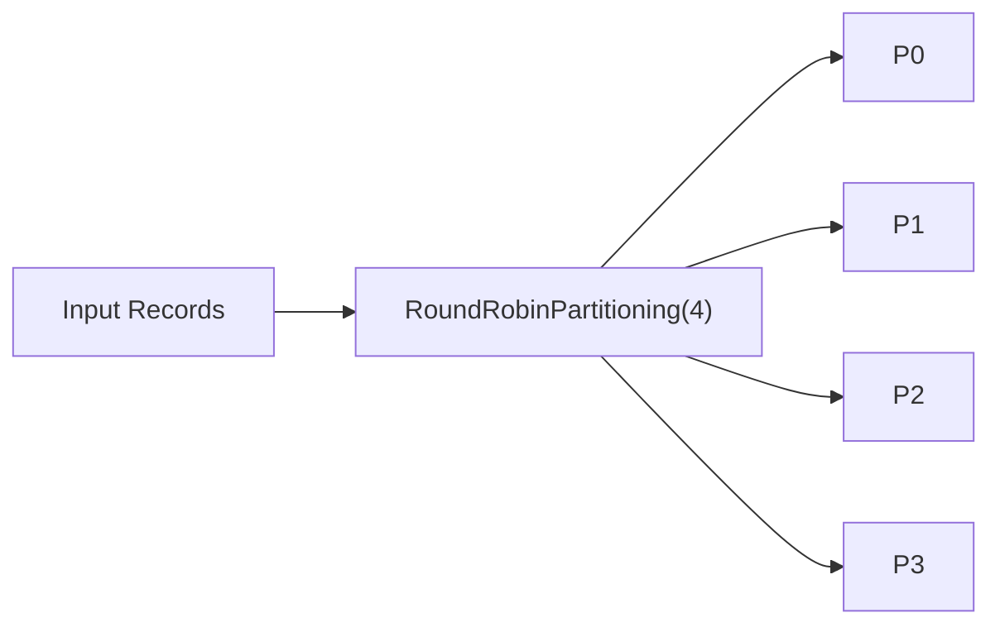

Conceptually:

```text
Record 1 → P0
Record 2 → P1
Record 3 → P2
Record 4 → P3
Record 5 → P0
...
```

---

## 7.3 repartition() by Column

```python
df.repartition(4, "department")
```

Physical plan:

```text
Exchange hashpartitioning(department, 4)
```

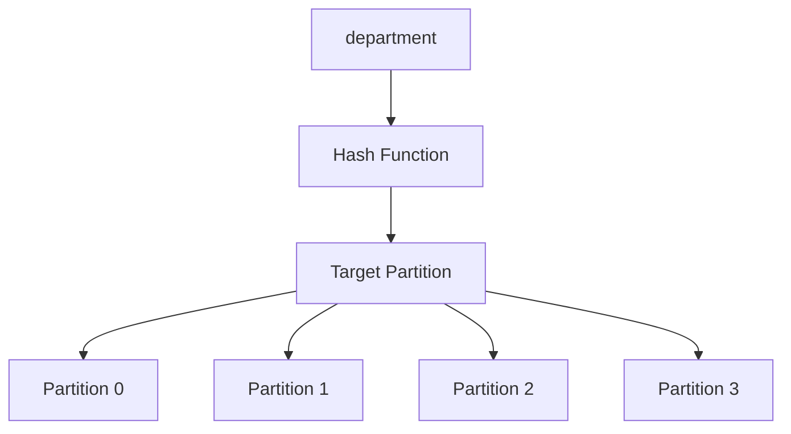

Conceptually:

```text
IT      → hash(IT)      → P2
HR      → hash(HR)      → P0
SALES   → hash(SALES)   → P3
IT      → hash(IT)      → P2
HR      → hash(HR)      → P0
```

The same key is directed to the same target partition.

---

## 7.4 coalesce()

```python
df.coalesce(2)
```

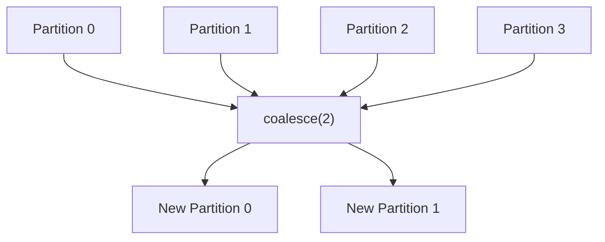

`coalesce()` is mainly used to reduce partitions and generally avoids a full shuffle.

---

## 7.5 repartition vs coalesce

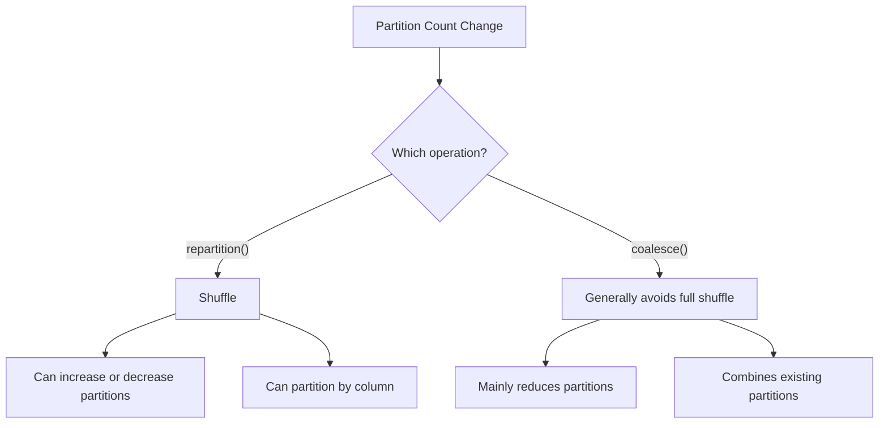

---

## 7.6 Example

```python
df.repartition(4).coalesce(2)
```

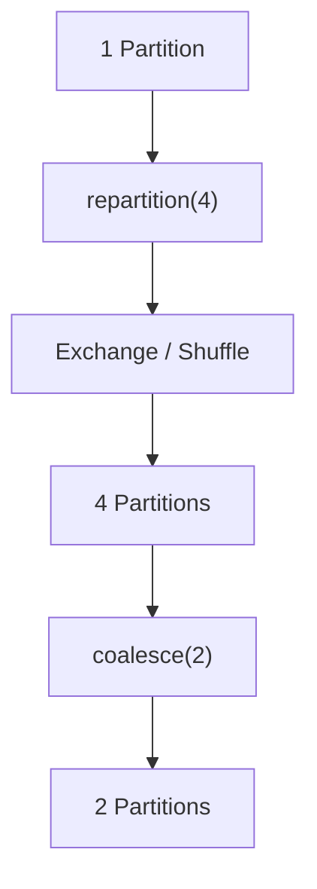

Important:

> The shuffle happens because of `repartition(4)`. `coalesce(2)` does not introduce another full shuffle.

---

## 7.7 coalesce(1)

```python
df.coalesce(1)
```

For a large dataset:

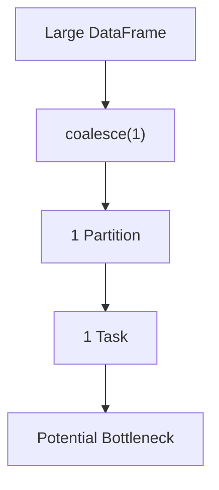

Avoid this for large production datasets unless a single output file is genuinely required.

---

# Part 8 — WholeStageCodegen

## 8.1 What is WholeStageCodegen?

WholeStageCodegen generates optimized JVM code for multiple compatible physical operators and fuses them into a single execution pipeline.

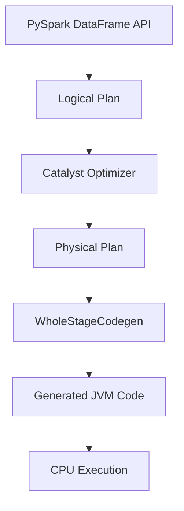

---

## 8.2 Operator Fusion

Example:

```python
result = (
    df
    .filter(df.salary > 50000)
    .select("name", "salary")
)
```

Conceptually:

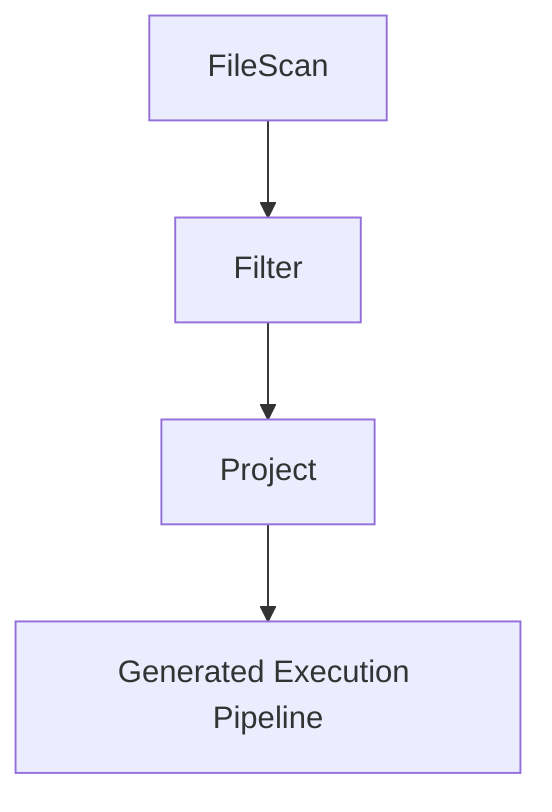

Instead of treating every compatible operator as completely independent, Spark can fuse them into a generated execution pipeline.

---

## 8.3 Identifying WholeStageCodegen

Example:

```text
*(1) Project
+- *(1) Filter
   +- FileScan
```

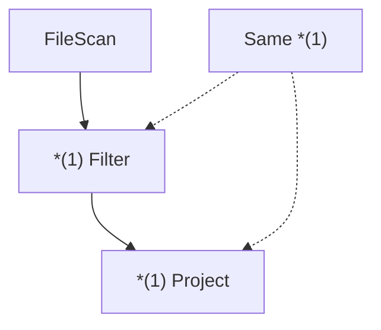

The repeated `*(1)` indicates that these operators participate in the same WholeStageCodegen pipeline.

**Important:** `*(1)` is not a Spark UI task number.

---

## 8.4 WholeStageCodegen vs Shuffle

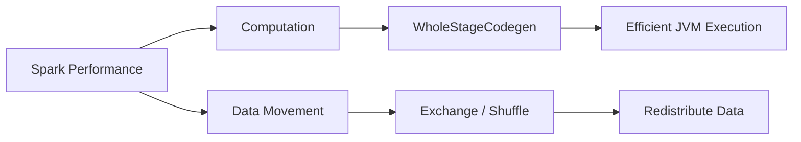

WholeStageCodegen does not remove required shuffle operations.

---

# Part 9 — Adaptive Query Execution (AQE)

## 9.1 AQE Flow

AQE allows Spark to adapt the physical execution plan during execution using runtime statistics.

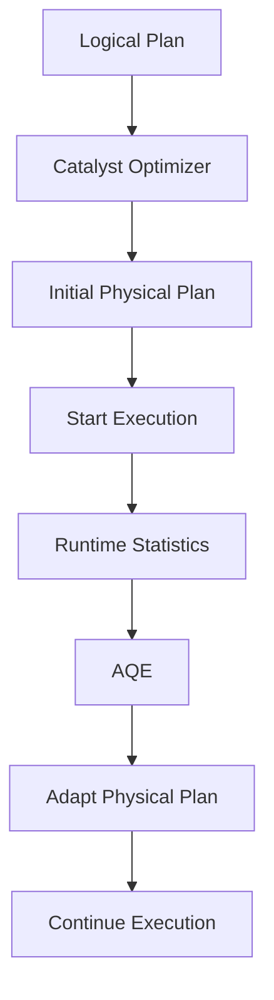

---

## 9.2 AQE Feature 1 — Coalesce Shuffle Partitions

Suppose:

```text
spark.sql.shuffle.partitions = 200
```

but the actual shuffle data is very small.

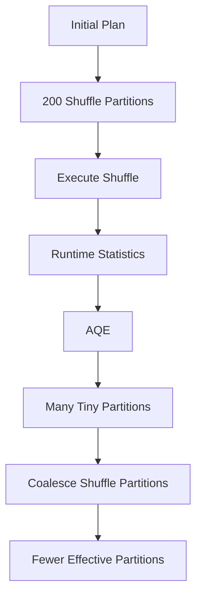

AQE may reduce unnecessary task overhead.

---

## 9.3 AQE vs coalesce()

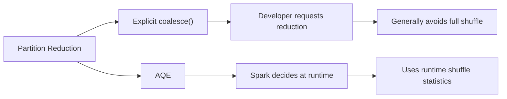

---

## 9.4 AQE Feature 2 — Skewed Joins

Example:

```text
P0 → 10 GB
P1 → 100 MB
P2 → 100 MB
P3 → 100 MB
```

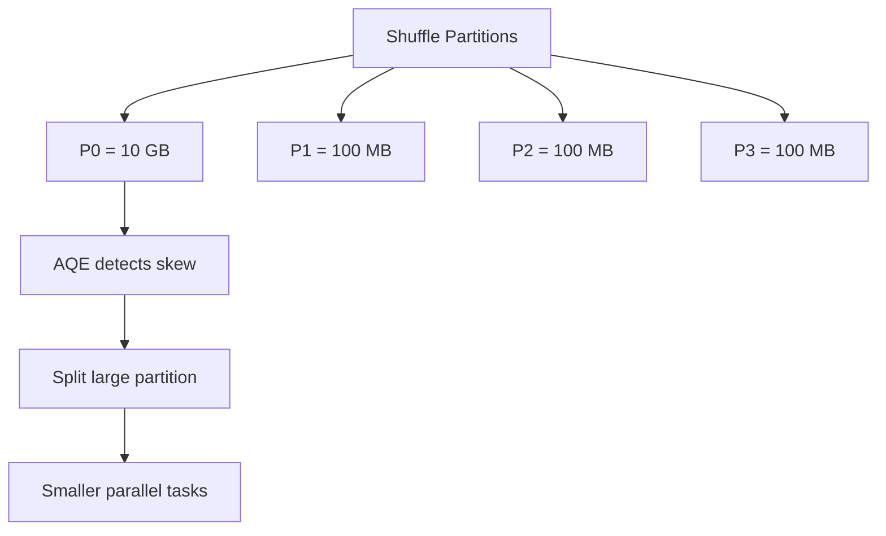

---

## 9.5 AQE Feature 3 — Dynamic Join Strategy

```mermaid
flowchart TD
    A["Initial Statistics"] --> B["Sort Merge Join"]
    B --> C["Runtime Statistics"]
    C --> D{"Is one side small?"}
    D -->|"Yes"| E["Broadcast Hash Join"]
    D -->|"No"| F["Continue with current strategy"]
```

---

## 9.6 Three Major AQE Features

```mermaid
mindmap
  root((AQE))
    Coalesce shuffle partitions
      Reduce unnecessary tasks
    Handle skewed joins
      Split large partitions
    Dynamic join strategy
      Use runtime statistics
```

---

## 9.7 Catalyst vs AQE

```mermaid
flowchart TD
    A["Logical Plan"] --> B["Catalyst"]
    B --> C["Optimized Physical Plan"]
    C --> D["Execution"]
    D --> E["Runtime Statistics"]
    E --> F["AQE"]
    F --> G["Adapted Execution Plan"]
```

### Remember

```text
Catalyst → optimization during query planning

AQE → adaptation during execution
```

---

# Part 10 — explain() + Spark UI

## 10.1 explain(True)

```python
df.explain(True)
```

shows:

```mermaid
flowchart TD
    A["explain(True)"] --> B["Parsed Logical Plan"]
    B --> C["Analyzed Logical Plan"]
    C --> D["Optimized Logical Plan"]
    D --> E["Physical Plan"]
```

---

## 10.2 Physical Plan

For:

```python
df.filter(df.salary > 50000) \
  .groupBy("department") \
  .count()
```

conceptually:

```mermaid
flowchart TD
    A["FileScan"] --> B["Filter"]
    B --> C["Project"]
    C --> D["Partial HashAggregate"]
    D --> E["Exchange"]
    E --> F["Shuffle"]
    F --> G["Final HashAggregate"]
```

---

## 10.3 Physical Plan Operators

| Operator | Meaning |
|---|---|
| `FileScan` | Read data |
| `Filter` | Filter rows |
| `Project` | Select/transform columns |
| `HashAggregate` | Aggregation |
| `Exchange` | Shuffle/data redistribution |
| `Coalesce` | Reduce partitions |
| `BroadcastHashJoin` | Broadcast join |
| `SortMergeJoin` | Shuffle/sort-based join |
| `AQEShuffleRead` | AQE shuffle reading |
| `*(...)` | WholeStageCodegen participation |

---

## 10.4 Exchange and Stages

```mermaid
flowchart TD
    A["Stage 0"] --> B["FileScan"]
    B --> C["Filter"]
    C --> D["Partial HashAggregate"]
    D --> E["Exchange / Shuffle"]
    E --> F["Stage 1"]
    F --> G["Final HashAggregate"]
```

An Exchange often creates a shuffle boundary between stages.

---

## 10.5 Stage vs Task

```mermaid
flowchart TD
    A["Stage"] --> B["Task 0"]
    A --> C["Task 1"]
    A --> D["Task 2"]
    A --> E["Task 3"]

    B --> P0["Partition 0"]
    C --> P1["Partition 1"]
    D --> P2["Partition 2"]
    E --> P3["Partition 3"]
```

Think:

> **Stage = collection of tasks**

> **Task = work performed on a partition**

---

## 10.6 Spark UI

When the application is running:

```text
http://localhost:4040
```

Important tabs:

```mermaid
flowchart LR
    A["Spark UI"] --> B["Jobs"]
    A --> C["Stages"]
    A --> D["SQL"]
    A --> E["Executors"]
    A --> F["Environment"]
```

For this course, focus mainly on:

```text
SQL
Stages
Jobs
```

---

## 10.7 Spark Performance Investigation

```mermaid
flowchart TD
    A["Spark UI"] --> B["Find Query"]
    B --> C["Inspect Stages"]
    C --> D["Inspect Tasks"]
    D --> E["Check Shuffle Read"]
    D --> F["Check Shuffle Write"]
    D --> G["Check Task Duration"]
    E --> H["Investigate Shuffle"]
    F --> H
    G --> I["Investigate Skew / Slow Tasks"]
```

---

# Part 11 — Performance Integration Exercise

## 11.1 Business Requirement

> Find the number of employees earning more than ₹50,000 in each department.

Dataset:

```text
datasets/employees.csv
```

Columns:

```text
employee_code
name
department
salary
```

---

## 11.2 Complete Integration Code

```python
from pyspark.sql import SparkSession

spark = (
    SparkSession.builder
    .appName("Day15_Part11_PerformanceIntegration")
    .getOrCreate()
)

# --------------------------------------------------
# Spark configuration
# --------------------------------------------------

print(
    "AQE enabled:",
    spark.conf.get("spark.sql.adaptive.enabled")
)

print(
    "Shuffle partitions:",
    spark.conf.get("spark.sql.shuffle.partitions")
)


# --------------------------------------------------
# Read data
# --------------------------------------------------

df = (
    spark.read
    .option("header", True)
    .option("inferSchema", True)
    .csv("datasets/employees.csv")
)

print(
    "Input partitions:",
    df.rdd.getNumPartitions()
)


# --------------------------------------------------
# Filter
# --------------------------------------------------

filtered_df = df.filter(
    df.salary > 50000
)


# --------------------------------------------------
# Aggregation
# --------------------------------------------------

result = (
    filtered_df
    .groupBy("department")
    .count()
)


# --------------------------------------------------
# Explain execution plan
# --------------------------------------------------

print("\n========== EXECUTION PLAN ==========\n")

result.explain(True)


# --------------------------------------------------
# Trigger execution
# --------------------------------------------------

print("\n========== RESULT ==========\n")

result.show()


# --------------------------------------------------
# Keep Spark UI available
# --------------------------------------------------

input(
    "\nOpen http://localhost:4040 to inspect Spark UI. "
    "Press Enter to stop Spark..."
)

spark.stop()
```

---

## 11.3 Complete Integration Flow

```mermaid
flowchart TD
    A["employees.csv"] --> B["FileScan"]
    B --> C["Filter salary > 50000"]
    C --> D["Project department"]
    D --> E["Partial HashAggregate"]
    E --> F["Exchange"]
    F --> G["Shuffle"]
    G --> H["Final HashAggregate"]
    H --> I["AQE"]
    I --> J["Stages"]
    J --> K["Tasks"]
    K --> L["Executors"]
    L --> M["Spark UI"]
```

---

## 11.4 Performance Analysis Flow

```mermaid
flowchart TD
    A["PySpark Query"] --> B["explain(True)"]
    B --> C["Physical Plan"]

    C --> D["Find Exchange"]
    C --> E["Find HashAggregate"]
    C --> F["Find *(...)"]
    C --> G["Find AQE"]

    D --> H["Understand Shuffle"]
    E --> I["Understand Aggregation"]
    F --> J["Understand Codegen"]
    G --> K["Understand Runtime Adaptation"]

    H --> L["Spark UI"]
    I --> L
    J --> L
    K --> L

    L --> M["Jobs"]
    L --> N["Stages"]
    L --> O["Tasks"]
    L --> P["Shuffle Read / Write"]
```

---

# Complete Spark Performance Mental Model

```mermaid
flowchart TD
    A["PySpark Code"] --> B["Logical Plan"]
    B --> C["Catalyst Optimizer"]
    C --> D["Optimized Logical Plan"]
    D --> E["Physical Plan"]

    E --> F["WholeStageCodegen"]
    E --> G["Exchange / Shuffle"]

    F --> H["Efficient JVM Computation"]
    G --> I["Data Redistribution"]

    H --> J["Execution"]
    I --> J

    J --> K["Runtime Statistics"]
    K --> L["AQE"]

    L --> M["Stages"]
    M --> N["Tasks"]
    N --> O["Executors"]
    O --> P["Spark UI"]
```

---

# Key Performance Concepts

## Data Movement

```mermaid
flowchart LR
    A["Data Movement"] --> B["Partitioning"]
    B --> C["Exchange"]
    C --> D["Shuffle"]
    D --> E["Network / Disk"]
```

Main concern:

> Minimize unnecessary data movement.

---

## Computation

```mermaid
flowchart LR
    A["Computation"] --> B["Filter"]
    B --> C["Project"]
    C --> D["Aggregate"]
    D --> E["WholeStageCodegen"]
    E --> F["Efficient JVM Execution"]
```

Main concern:

> Execute CPU work efficiently.

---

## Runtime Optimization

```mermaid
flowchart LR
    A["Runtime Statistics"] --> B["AQE"]
    B --> C["Coalesce Partitions"]
    B --> D["Handle Skew"]
    B --> E["Change Join Strategy"]
```

Main concern:

> Adapt execution using actual runtime statistics.

---

# Final Day 15 Execution Picture

For:

```python
df.filter(df.salary > 50000) \
  .groupBy("department") \
  .count()
```

Think:

```mermaid
flowchart TD
    A["employees.csv"] --> B["FileScan"]
    B --> C["Filter"]
    C --> D["Project"]
    D --> E["Partial HashAggregate"]
    E --> F["Exchange"]
    F --> G["Shuffle"]
    G --> H["Final HashAggregate"]
    H --> I["AQE"]
    I --> J["Stages"]
    J --> K["Tasks"]
    K --> L["Executors"]
    L --> M["Spark UI"]
```

---

# Day 15 Interview Questions

## Q1. What is shuffle?

Shuffle is the redistribution of data across partitions, usually involving network and possibly disk I/O, so that records required by a downstream operation are colocated.

Common causes:

```text
groupBy
join
distinct
repartition
```

---

## Q2. What is Exchange?

`Exchange` represents a shuffle/data redistribution boundary in the physical plan.

Example:

```text
Exchange hashpartitioning(department, 200)
```

---

## Q3. Why does groupBy require shuffle?

Because the same grouping key can exist in multiple input partitions.

Spark needs to bring records with the same key together before final aggregation.

---

## Q4. What is HashAggregate?

It is a physical operator used to perform aggregation using a hash-based structure.

Spark commonly performs:

```text
Partial HashAggregate
        ↓
Exchange
        ↓
Final HashAggregate
```

---

## Q5. Why does Spark perform partial aggregation?

To reduce the amount of data that must be shuffled.

---

## Q6. Difference between repartition and coalesce?

`repartition()` performs a shuffle and can increase or decrease partitions.

`coalesce()` is mainly used to reduce partitions and generally avoids a full shuffle.

---

## Q7. Can repartition partition by a column?

Yes.

```python
df.repartition(4, "department")
```

This can produce:

```text
Exchange hashpartitioning(department, 4)
```

---

## Q8. What is RoundRobinPartitioning?

It distributes records across partitions without using a particular key.

Example:

```python
df.repartition(4)
```

can produce:

```text
RoundRobinPartitioning(4)
```

---

## Q9. What is WholeStageCodegen?

WholeStageCodegen generates optimized JVM code for multiple compatible physical operators and fuses them into an execution pipeline, reducing CPU/execution overhead.

---

## Q10. Does WholeStageCodegen remove shuffle?

No.

WholeStageCodegen optimizes computation.

Shuffle handles data redistribution.

---

## Q11. What is AQE?

Adaptive Query Execution allows Spark to adapt the physical execution plan during execution using runtime statistics.

---

## Q12. What are the major AQE features?

```text
1. Coalesce shuffle partitions
2. Handle skewed joins
3. Dynamically change join strategy
```

---

## Q13. What is data skew?

Data skew occurs when data is distributed very unevenly across partitions.

Example:

```text
P0 → 10 GB
P1 → 100 MB
P2 → 100 MB
P3 → 100 MB
```

P0 can become a bottleneck.

---

## Q14. How can AQE handle skew?

AQE can detect skewed shuffle partitions and split them into smaller pieces to improve parallelism.

---

## Q15. Catalyst vs AQE?

```text
Catalyst
→ Query optimization during planning

AQE
→ Physical plan adaptation during execution
  using runtime statistics
```

---

## Q16. What is a Spark stage?

A stage is a set of operations that can execute together without crossing a shuffle boundary.

---

## Q17. What is a Spark task?

A task is the unit of execution that processes a partition within a stage.

---

## Q18. How are stages and tasks related?

```mermaid
flowchart TD
    A["Stage"] --> B["Task 0"]
    A --> C["Task 1"]
    A --> D["Task 2"]
    A --> E["Task 3"]

    B --> F["Partition 0"]
    C --> G["Partition 1"]
    D --> H["Partition 2"]
    E --> I["Partition 3"]
```

---

## Q19. What is the difference between explain() and Spark UI?

`explain()` shows the query plans and physical execution strategy.

Spark UI provides runtime information such as:

```text
Jobs
Stages
Tasks
Shuffle Read
Shuffle Write
Task Duration
```

---

## Q20. What should you look for when analyzing a physical plan?

Look for:

```text
Exchange
HashAggregate
BroadcastHashJoin
SortMergeJoin
Coalesce
AQEShuffleRead
*(...)
```

These provide clues about:

- shuffle
- aggregation
- joins
- partitioning
- AQE
- code generation

---

# Day 15 Completion Checklist

- [x] Understand `groupBy()`
- [x] Understand Partial and Final `HashAggregate`
- [x] Understand `Exchange`
- [x] Understand shuffle
- [x] Understand `repartition()`
- [x] Understand `coalesce()`
- [x] Understand RoundRobinPartitioning
- [x] Understand HashPartitioning
- [x] Understand WholeStageCodegen
- [x] Understand operator fusion
- [x] Understand AQE
- [x] Understand AQE partition coalescing
- [x] Understand skew handling
- [x] Understand dynamic join strategy
- [x] Understand Catalyst vs AQE
- [x] Understand `explain(True)`
- [x] Understand stages and tasks
- [x] Understand Spark UI
- [x] Understand Shuffle Read / Shuffle Write
- [x] Complete performance integration exercise

---

# Final Day 15 Takeaway

> **Spark performance is largely about understanding where data moves, how computation is executed, and how Spark adapts the execution plan at runtime.**

The three core concepts:

```mermaid
flowchart LR
    A["Spark Performance"] --> B["Exchange / Shuffle"]
    A --> C["WholeStageCodegen"]
    A --> D["AQE"]

    B --> E["Data Movement"]
    C --> F["Efficient Computation"]
    D --> G["Runtime Plan Optimization"]
```

The complete workflow:

```mermaid
flowchart TD
    A["PySpark"] --> B["Logical Plan"]
    B --> C["Catalyst"]
    C --> D["Physical Plan"]
    D --> E["WholeStageCodegen"]
    D --> F["Exchange / Shuffle"]
    E --> G["Execution"]
    F --> G
    G --> H["AQE"]
    H --> I["Stages"]
    I --> J["Tasks"]
    J --> K["Executors"]
    K --> L["Spark UI"]
```

## Day 15 — Final Mental Model

```text
Data movement  → Exchange / Shuffle
Computation     → WholeStageCodegen
Runtime tuning  → AQE
Observation     → explain() + Spark UI
```

This completes the core **Spark Execution Plan & Performance** learning for Day 15.
