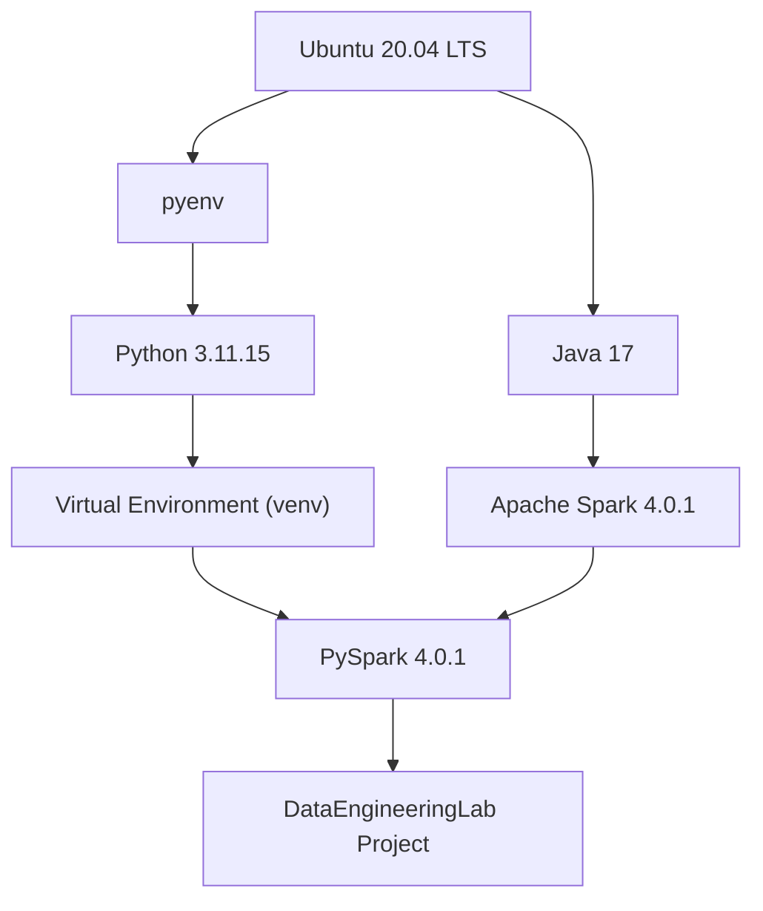
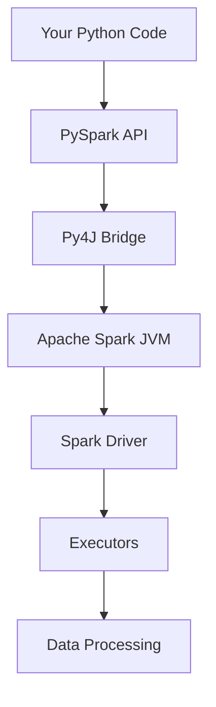
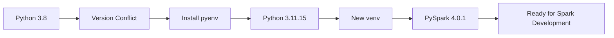

# Day 11 - Part 2
# Environment Modernization for PySpark Development

## 🎯 Objective

Prepare a professional, production-ready development environment for learning PySpark.

Instead of simply installing PySpark, we modernized the complete Python and Spark environment to ensure long-term compatibility and reproducibility.

---

# Why We Changed the Original Plan

Initially the plan was:

- Install Java
- Install Apache Spark
- Install PySpark
- Start coding

During installation we discovered that our existing project was using:

- Python 3.8
- Apache Spark 4.0.1

However,

```
pip install pyspark
```

installed

```
PySpark 3.5.9
```

instead of

```
PySpark 4.0.1
```

### Root Cause

Python 3.8 is not compatible with Spark 4.x.

Instead of downgrading Spark, we decided to modernize the environment.

---

# Final Environment

| Component    | Version   |
| ------------ | --------- |
| Ubuntu       | 20.04 LTS |
| Java         | 17        |
| Python       | 3.11.15   |
| pyenv        | 2.8.1     |
| Apache Spark | 4.0.1     |
| PySpark      | 4.0.1     |

---

## Environment Architecture



# Learning Outcomes

Today we learned

- Why Spark requires Java
- Difference between Apache Spark and PySpark
- Why Python version compatibility matters
- Why professional developers use pyenv
- Difference between System Python and Project Python
- Why virtual environments should be project specific
- Why Spark and PySpark versions should match
- How Spark chooses the Python interpreter
- Why requirements.txt should contain direct dependencies instead of pip freeze output

---

# Commands Executed

## Verify Java

```bash
java -version

echo $JAVA_HOME
```

---

## Create Spark Installation Directory

```bash
cd ~

mkdir -p tools

cd tools
```

---

## Download Apache Spark

```bash
wget https://archive.apache.org/dist/spark/spark-4.0.1/spark-4.0.1-bin-hadoop3.tgz
```

---

## Extract Spark

```bash
tar -xzf spark-4.0.1-bin-hadoop3.tgz
```

---

## Configure Spark

Added into

```
~/.bashrc
```

```bash
export JAVA_HOME=/usr/lib/jvm/java-17-openjdk-amd64
export PATH=$PATH:$JAVA_HOME/bin

export SPARK_HOME=$HOME/tools/spark-4.0.1-bin-hadoop3
export PATH=$PATH:$SPARK_HOME/bin:$SPARK_HOME/sbin
```

Reload

```bash
source ~/.bashrc
```

Verify

```bash
spark-shell --version
```

## Python Version Management


---

# Install pyenv

Install dependencies

```bash
sudo apt update

sudo apt install -y \
build-essential \
curl \
git \
libssl-dev \
zlib1g-dev \
libbz2-dev \
libreadline-dev \
libsqlite3-dev \
wget \
llvm \
libncurses5-dev \
libncursesw5-dev \
xz-utils \
tk-dev \
libffi-dev \
liblzma-dev \
python3-openssl
```

Install pyenv

```bash
curl https://pyenv.run | bash
```

---

# Configure pyenv

Added to

```
~/.bashrc
```

```bash
export PYENV_ROOT="$HOME/.pyenv"

[[ -d $PYENV_ROOT/bin ]] && export PATH="$PYENV_ROOT/bin:$PATH"

eval "$(pyenv init - bash)"

eval "$(pyenv virtualenv-init -)"
```

Reload

```bash
source ~/.bashrc
```

Verify

```bash
pyenv --version
```

---

# Install Python 3.11

List versions

```bash
pyenv install --list | grep "3.11"
```

Install

```bash
pyenv install 3.11.15
```

Project specific version

```bash
cd /mnt/d/Projects/DataEngineeringLab

pyenv local 3.11.15
```

Verify

```bash
python --version
```

---

# Recreate Virtual Environment

Remove old environment

```bash
rm -rf venv
```

Create new

```bash
python -m venv venv
```

Activate

```bash
source venv/bin/activate
```

Verify

```bash
python --version
```

---

# Upgrade pip

```bash
pip install --upgrade pip setuptools wheel
```

## Spark Runtime Architecture



---

# Install PySpark

```bash
pip install pyspark==4.0.1
```

Verify

```bash
python -c "import pyspark; print(pyspark.__version__)"
```

---

# Spark Python Configuration

Updated

```bash
export PYSPARK_PYTHON=python3
```

to

```bash
export PYSPARK_PYTHON=$(pyenv which python)
```

This ensures Spark always uses the Python interpreter selected by pyenv.

## Environment Modernization Journey



## Complete Development Stack

```mermaid
graph TD

subgraph Operating_System
Ubuntu["Ubuntu 20.04 LTS"]
end

subgraph Language
Pyenv["pyenv"]
Python["Python 3.11.15"]
end

subgraph Environment
Venv["Virtual Environment"]
end

subgraph Big_Data
Spark["Apache Spark 4.0.1"]
PySpark["PySpark 4.0.1"]
end

subgraph Project
Project["DataEngineeringLab"]
end

Ubuntu --> Pyenv

Pyenv --> Python

Python --> Venv

Venv --> PySpark

Spark --> PySpark

PySpark --> Project
```

---

# Challenges Faced

## Challenge 1

Spark 4.0.1 download URL returned

```
404 Not Found
```

### Resolution

Downloaded from Apache Archive.

---

## Challenge 2

PySpark installed version

```
3.5.9
```

instead of

```
4.0.1
```

### Root Cause

Python 3.8 compatibility.

### Resolution

Modernized the environment using pyenv.

---

## Challenge 3

Ubuntu 20.04

```
apt install python3.11
```

failed.

### Resolution

Installed Python using pyenv instead of modifying Ubuntu.

---

## Challenge 4

Old virtual environment built using Python 3.8.

### Resolution

Removed old venv and recreated it using Python 3.11.15.

---

# Best Practices Learned

✔ Never replace Ubuntu's System Python.

✔ Use pyenv for managing Python versions.

✔ Use one virtual environment per project.

✔ Keep Spark and PySpark versions aligned.

✔ Prefer direct dependencies in requirements.txt.

✔ Commit `.python-version` to Git.

✔ Do not commit `venv/`.

---

# Git Commit

```bash
git add .

git commit -m "Release 2: Modernize Python environment with pyenv and Spark 4.0.1"
```

---

# Release 2 Milestone

Successfully modernized the DataEngineeringLab environment.

Current Stack

```
Ubuntu 20.04
        │
Java 17
        │
pyenv
        │
Python 3.11.15
        │
Virtual Environment
        │
Apache Spark 4.0.1
        │
PySpark 4.0.1
```

---

# Next Session (Day 12)

## First Spark Application

Topics

- SparkSession
- SparkContext
- Driver Process
- Create First Spark Application
- Read CSV using Spark
- DataFrame Basics
- Lazy Evaluation
- Actions vs Transformations
- Spark UI
- Jobs
- Stages
- Tasks
- Compare Pandas vs Spark
