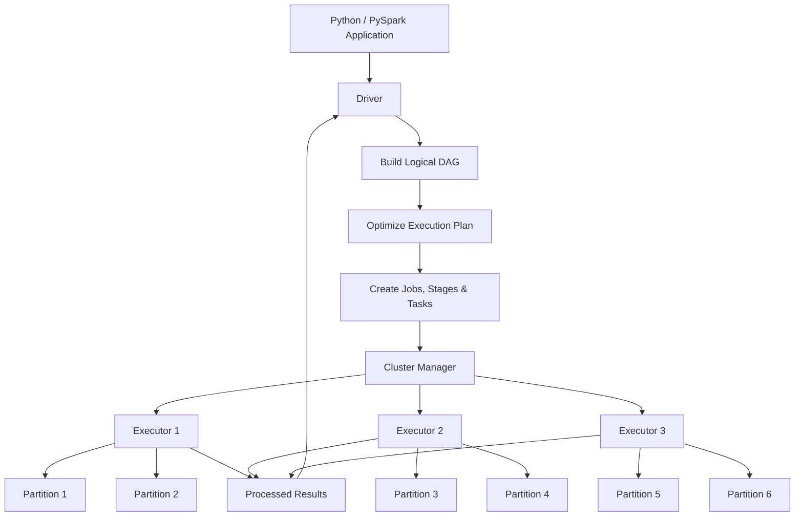
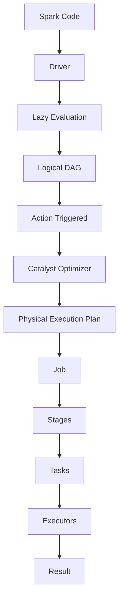
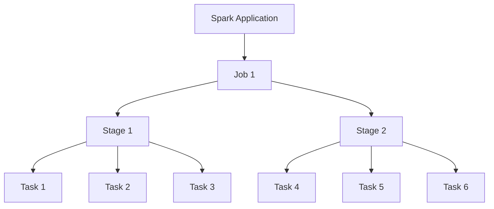
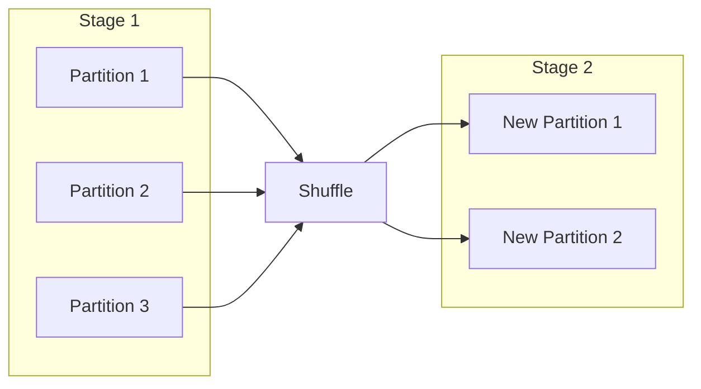

# Day 11 - Part 1
# PySpark Fundamentals - Big Data Concepts & Spark Architecture

## Phase 2 - Big Data Engineering with PySpark

---

# Objective

Transition from traditional Python ETL to distributed data processing using Apache Spark.

The goal of this session is to understand **why Spark exists**, how distributed computing works, and the internal execution model of Spark before writing any PySpark code.

---

# Learning Outcomes

By the end of this session, I understood:

- Why traditional Python ETL has scalability limitations
- Why Apache Spark was developed
- Distributed Computing fundamentals
- Spark Architecture
- Driver, Executors and Cluster Manager
- Lazy Evaluation
- Directed Acyclic Graph (DAG)
- DAG Optimization
- Actions vs Transformations
- Jobs, Stages and Tasks
- Partitions
- Shuffle
- Data Skew
- Spark Performance Thinking

---

# 1. Why Spark?

Traditional Python ETL works well for small to medium datasets.

Example:

```python
df = pd.read_csv("employees.csv")
```

Pandas loads the complete dataset into the memory (RAM) of a single machine.

For large datasets (TB/PB scale), this approach is not feasible because the data cannot fit into the memory of one machine.

Spark solves this problem by distributing data across multiple machines.

---

# 2. Distributed Computing

Instead of processing an entire dataset on a single machine:

```
Large Dataset

↓

One Machine

↓

Processing
```

Spark distributes the work:

```
Large Dataset

↓

Partitions

↓

Machine 1
Machine 2
Machine 3
Machine 4

↓

Combined Result
```

Advantages:

- Parallel Processing
- Better Resource Utilization
- Horizontal Scaling
- Fault Tolerance

---

# 3. Spark Architecture

```


---

## Driver

The Driver is the brain of a Spark Application.

Responsibilities:

- Reads Spark code
- Creates Logical DAG
- Optimizes Execution Plan
- Creates Jobs
- Creates Stages
- Creates Tasks
- Schedules Tasks
- Monitors Execution
- Collects Results

The Driver does **not** process data.

---

## Executors

Executors are worker processes.

Responsibilities:

- Execute Tasks
- Read Data
- Perform Transformations
- Store Intermediate Results
- Return Results to Driver

---

## Cluster Manager

Responsible for:

- Allocating Resources
- Starting Executors
- Managing CPU and Memory
- Monitoring Cluster Resources

Examples:

- Spark Standalone
- YARN
- Kubernetes

---

# 4. Spark Execution Model

```


---

# 5. Lazy Evaluation

Spark does not execute transformations immediately.

Instead, Spark records all transformations and creates a Logical Execution Plan (DAG).

Execution begins only when an **Action** is called.

Example:

```python
df = spark.read.csv(...)

df = df.filter(...)

df = df.select(...)
```

No execution occurs.

Execution starts only after:

```python
df.show()

df.count()

df.collect()

df.write()
```

---

# 6. DAG (Directed Acyclic Graph)

DAG represents the sequence of transformations.

Example:

```
Read CSV

↓

Filter

↓

Select

↓

Group By

↓

Result
```

Spark builds this logical workflow before execution.

---

# 7. DAG Optimization

Once an Action is triggered, Spark optimizes the DAG before execution.

Optimization may include:

- Eliminating unnecessary operations
- Reducing data movement
- Optimizing filters
- Improving execution strategy

Only after optimization does Spark execute the plan.

---

# 8. Transformations vs Actions

## Transformations

Transformations are lazy.

Examples:

- filter()
- select()
- withColumn()
- groupBy()

Transformations build the DAG.

---

## Actions

Actions trigger execution.

Examples:

- show()
- count()
- collect()
- write()

Each Action creates a Spark Job.

---

# 9. Jobs

A Job represents the complete execution triggered by an Action.

Rule:

> One Action generally creates one Job.

Example:

```python
df.show()
```

↓

One Job

---
# Spark Job Breakdown



# 10. Stages

A Stage is a collection of Tasks that can execute without requiring a Shuffle.

Rule:

Every Job contains at least one Stage.

Each Shuffle creates an additional Stage.

Example:

```
Read

↓

Filter

↓

Stage 1

↓

Shuffle

↓

Stage 2

↓

GroupBy

↓

Result
```

---

# 11. Tasks

A Task is the smallest unit of execution.

Rule:

One Partition = One Task (per Stage)

Example:

40 Partitions

↓

40 Tasks

---

# 12. Partitions

Partitions divide a dataset into smaller pieces.

Spark processes partitions independently.

Benefits:

- Parallel Processing
- Better Scalability
- Fault Recovery

---

# 13. Parallelism

Example:

100 Partitions

20 Executor Cores

Only 20 Tasks execute simultaneously.

Remaining Tasks wait until executor cores become available.

Rule:

One Executor Core executes one Task at a time.

---

# 14. Shuffle

Shuffle occurs when Spark must redistribute data across partitions.

Common operations causing Shuffle:

- groupBy()
- join()
- distinct()
- orderBy()

Shuffle is expensive because it involves:

- Network Communication
- Disk I/O
- Serialization
- Memory Usage

---

# Shuffle Between Stages



# 15. Data Skew

Data Skew occurs when work is distributed unevenly across partitions.

Example:

```
Department

HR      → 90%

IT       → 5%

Sales    → 5%
```

One executor receives significantly more work than others.

Effects:

- Slow Tasks
- Idle Executors
- Poor Performance

Common Causes:

- Uneven distribution of data
- Hot Keys
- Skewed Join Keys
- Poor Partitioning Strategy

---

# 16. Spark Performance Mindset

When a Spark job is slow, a beginner typically changes configuration values.

A Spark Engineer investigates:

- Number of Partitions
- Number of Stages
- Shuffle Operations
- Data Skew
- Task Distribution
- Executor Utilization
- Execution Plan
- Stage Duration

Spark provides tools such as:

- Spark UI
- Execution Plans (`explain()`)
- Job Metrics
- Stage Metrics
- Task Metrics

---

# Important Rules Learned

## Rule 1

One Action → One Job

---

## Rule 2

One Partition → One Task (per Stage)

---

## Rule 3

One Executor Core → One Running Task

---

## Rule 4

Every Job has at least one Stage.

Each Shuffle creates an additional Stage.

---

## Rule 5

Lazy Evaluation builds the Logical DAG.

Execution begins only after an Action.

---

## Rule 6

Driver schedules work.

Executors execute work.

---

## Rule 7

Data Skew is caused by uneven distribution of data, not simply duplicate values.

---

# Key Interview Takeaways

- Spark is a distributed processing engine, not just a Python library.
- Lazy Evaluation allows Spark to optimize execution before processing data.
- The Driver is the brain of a Spark application.
- Executors perform actual data processing.
- One Action creates one Job.
- One Partition creates one Task per Stage.
- Every Job contains at least one Stage.
- Shuffle is one of the most expensive Spark operations.
- Data Skew is one of the most common performance bottlenecks in Spark.

---

# Session Summary

In this session, the focus was on understanding Spark's execution model rather than writing PySpark code.

The concepts of Driver, Executors, Jobs, Stages, Tasks, Partitions, Lazy Evaluation, DAG, Shuffle and Data Skew were explored to build a strong conceptual foundation before moving to practical Spark programming.

---

# Next Session (Day 11 - Part 2)

- Java Installation
- Apache Spark Installation
- PySpark Installation
- SparkSession
- Development Environment
- First PySpark Program
- Reading CSV
- Basic DataFrame Operations
- First Spark Execution
