# Day 12 - Mermaid Diagrams
## Phase 2 - Big Data Engineering with PySpark

This document contains all Mermaid diagrams used during Day 12.

---

# 1. Spark Application Architecture

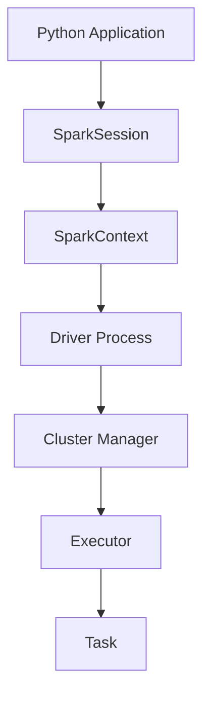

---

# 2. Spark Application Lifecycle

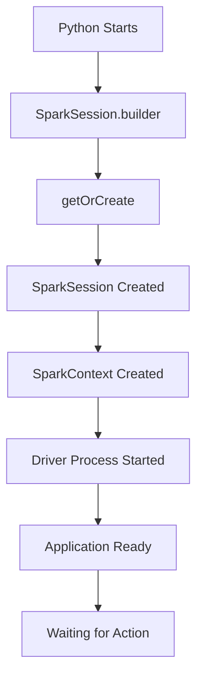

---

# 3. Lazy Evaluation

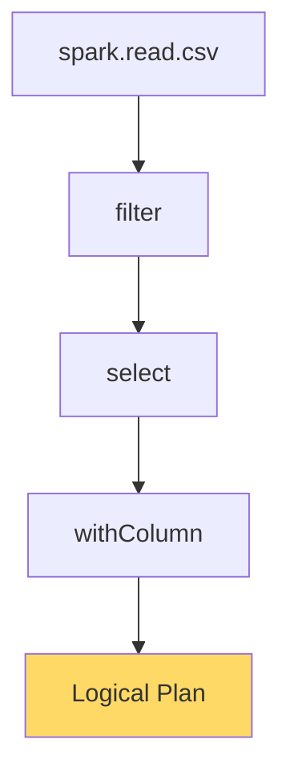

---

# 4. Action Triggers Execution

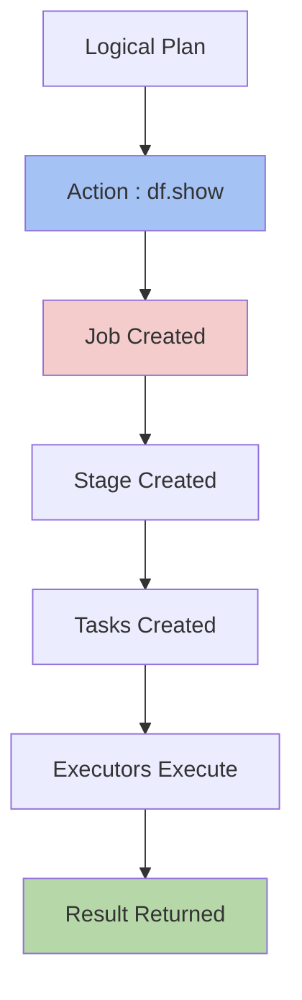

---

# 5. Spark Execution Hierarchy

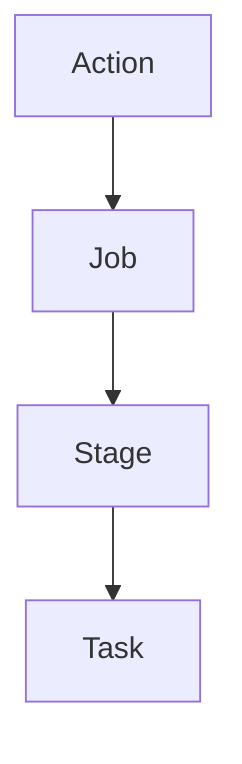

---

# 6. Complete Spark Execution Flow

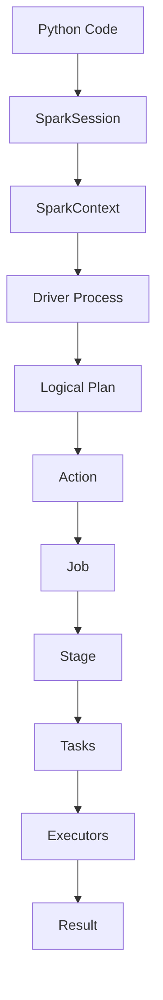

---

# 7. Driver and Executors

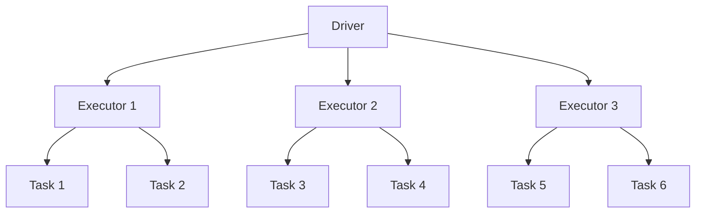

---

# 8. Partitions → Tasks

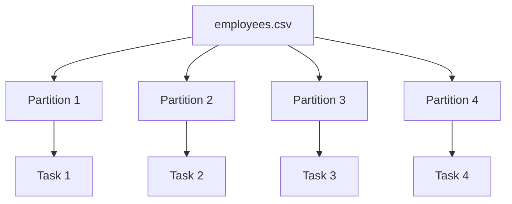

---

# 9. Parallel Task Execution

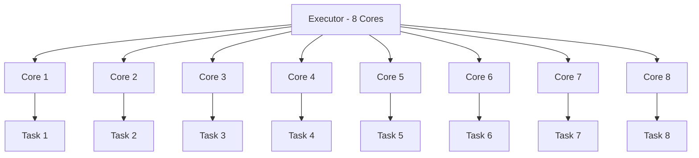

---

# 10. Task Scheduling in Waves

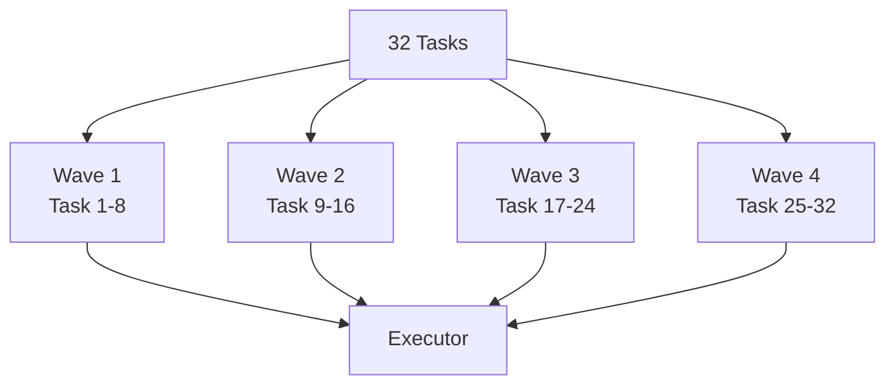

---

# 11. Local Mode vs Distributed Mode

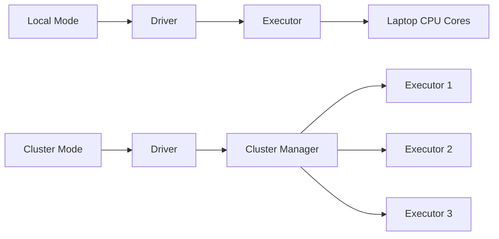

---

# 12. Pandas vs Spark

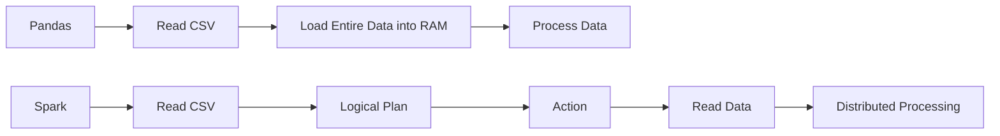

---

# 13. Complete Day 12 Summary Diagram ⭐

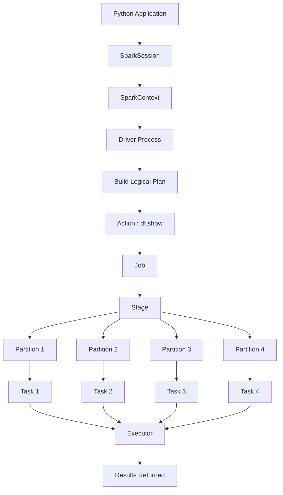

---

# Day 12 Key Takeaways

- SparkSession is the entry point.
- SparkContext communicates with the cluster.
- Driver coordinates execution.
- DataFrames store a Logical Plan.
- Lazy Evaluation delays execution.
- Actions trigger execution.
- Actions create Jobs.
- Jobs are divided into Stages.
- Stages are divided into Tasks.
- One Partition creates One Task.
- Executors execute Tasks.
- Parallelism depends on Partitions and available CPU Cores.
- Spark executes Tasks in waves when Tasks > Available Cores.
