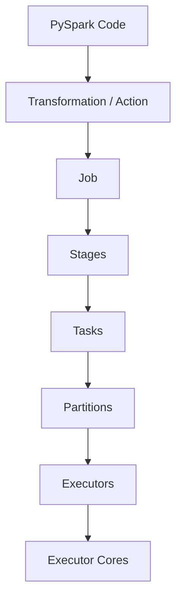

# Day 13 - Spark UI & Spark Execution Engine

## Phase 2 - Big Data Engineering with PySpark

---

## Objectives

Day 13 focused on understanding how Spark executes PySpark DataFrame code.

We used the Spark UI and practical experiments to understand:

- Spark UI
- Jobs
- Stages
- Tasks
- Partitions
- Executors
- Executor cores
- Task concurrency
- Shuffle
- Shuffle Read / Shuffle Write
- Skipped tasks and stages
- Shuffle reuse
- DataFrame caching
- Storage tab
- Lazy evaluation
- Spark execution flow

The main goal was to connect PySpark code with the execution behavior visible in Spark UI.

---

## 1. Spark UI

When Spark is running locally, the Spark UI is normally available at:

```text
http://localhost:4040
```

Important Spark UI tabs:

```text
Jobs
Stages
Storage
Environment
Executors
SQL / DataFrame
```

The Spark UI is useful because it shows what Spark actually executed.

---

## 2. Spark Execution Model

The basic execution relationship is:


A more precise mental model is:

```text
Transformation
      |
      v
Lazy Execution Plan
      |
      v
Action
      |
      v
Job
      |
      v
Stages
      |
      v
Tasks
      |
      v
Partitions
      |
      v
Executor Cores
```

---

## 3. Transformations and Actions

Example:

```python
filtered_df = df.filter(df.salary > 50000)
```

`filter()` is a transformation.

It is lazy.

Spark creates another DataFrame representing the transformation but does not need to execute the complete computation immediately.

When we run:

```python
filtered_df.show()
```

`show()` is an action and triggers execution.

Conceptually:

```text
filter()
   |
   | lazy
   v
Execution Plan
   |
   | show()
   v
Job
   |
   v
Stage
   |
   v
Tasks
```

### Important

A transformation does not necessarily produce an immediate terminal result.

An action requests a result and causes Spark to execute the required plan.

---

## 4. Jobs

A Spark Job is a unit of execution triggered by an action.

Common actions include:

```python
df.show()
df.count()
df.collect()
df.write.csv(...)
```

For example:

```python
df.filter(df.salary > 50000).show()
```

The `filter()` is lazy, while `show()` triggers the Job.

The Jobs tab can show:

- Job ID
- Description
- Duration
- Number of stages
- Number of tasks
- Job status

---

## 5. Stages

A Job can contain one or more stages.

The key rule is:

> A shuffle boundary separates stages.

For example:

```python
df.repartition(4)
```

requires redistribution of data.

Conceptually:

```text
Stage 0
   |
   v
Shuffle Write
   |
   v
Shuffle Data
   |
   v
Shuffle Read
   |
   v
Stage 1
```

Therefore:

```text
Job
 |
 +--- Stage 0
 |
 +--- Stage 1
```

A stage contains tasks that can execute without crossing another shuffle boundary.

---

## 6. Narrow Transformations

A narrow transformation does not require a large redistribution of data.

Examples:

```python
filter()
select()
withColumn()
```

Conceptually:

```text
Parent Partition
       |
       v
Child Partition
```

The required data can be processed without a full redistribution across the cluster.

---

## 7. Wide Transformations

A wide transformation requires data redistribution.

Examples:

```python
repartition()
groupBy()
join()
orderBy()
```

Conceptually:

```text
Partition 0 ──┐
Partition 1 ──┤
Partition 2 ──┼──> Shuffle ──> New Partitions
Partition 3 ──┘
```

Wide transformations are important for Spark performance because shuffle can involve significant data movement and I/O.

---

## 8. Partitions

A partition is a logical chunk of distributed data.

Suppose the DataFrame contains:

```text
12 rows
```

and we run:

```python
df = df.repartition(4)
```

Spark creates:

```text
4 partitions
```

The number of rows is still:

```text
12
```

Therefore:

```text
12 rows
   |
   | repartition(4)
   v
Partition 0
Partition 1
Partition 2
Partition 3

Total rows = 12
```

### Important distinction

```text
Partition = chunk of data

Partition != row

Partition != Task
```

---

## 9. Tasks

A Task is a unit of work that processes one partition for a stage.

A useful mental model is:

```text
1 Partition
     |
     v
1 Task
```

Therefore, if a stage needs to process 4 partitions:

```text
4 Partitions
     |
     v
4 Tasks
```

The number of tasks represents the work that needs to be performed.

The number of executor cores determines how much of that work can run concurrently.

---

## 10. Executors

An Executor is a process responsible for executing Spark tasks and holding data for the Spark application.

In a distributed environment:

```text
Driver
   |
   +---- Executor 1
   |         |
   |         +---- Tasks
   |
   +---- Executor 2
   |         |
   |         +---- Tasks
   |
   +---- Executor 3
             |
             +---- Tasks
```

The Driver coordinates the application.

Executors execute tasks.

---

## 11. Local Mode

Our Spark application is running in local mode.

The Spark UI showed:

```text
Executor ID: driver
```

This happens because the Driver process also performs task execution in local mode.

Conceptually:

```text
Local Mode

Driver
  |
  +-- Task
  +-- Task
  +-- Task
  +-- Task
```

This is different from a distributed Spark cluster where the Driver and Executors are separate processes.

---

## 12. Executor Cores and Task Concurrency

Our local Spark UI showed:

```text
Cores: 4
```

Suppose a stage has:

```text
10 partitions
```

Then approximately:

```text
10 tasks
```

are required.

But with 4 available cores:

```text
10 Tasks
   |
   +-- 4 running
   |
   +-- 6 waiting
```

When a task finishes, its core becomes available for another waiting task.

Therefore:

```text
Total Tasks      = 10
Available Cores  = 4
Concurrent Tasks = approximately 4
```

The total task count and concurrent task count are different concepts.

---

## 13. Multiple Executors

Suppose:

```text
Executor 1 = 4 cores
Executor 2 = 4 cores
```

Then:

```text
Total available cores = 8
```

If a stage contains:

```text
20 partitions
```

then:

```text
Total Tasks       = 20
Concurrent Tasks  = approximately 8
```

Conceptually:

```text
20 Tasks
   |
   +-- 8 running
   |
   +-- 12 waiting
```

As tasks complete, waiting tasks are scheduled onto available cores.

### Interview-quality answer

> The number of partitions determines the amount of task work for a stage, while available executor cores determine how many tasks can execute concurrently.

---

## 14. Shuffle

Shuffle occurs when Spark redistributes data between partitions.

Example:

```python
df.repartition(4)
```

Conceptually:

```text
Existing Partitions
       |
       v
Shuffle Write
       |
       v
Shuffle Data
       |
       v
Shuffle Read
       |
       v
New Partitions
```

Shuffle can involve:

- Data redistribution
- Network I/O in a cluster
- Disk I/O
- Serialization
- Additional computation

Therefore, unnecessary shuffle should generally be avoided.

---

## 15. Shuffle Write

Shuffle Write happens on the upstream side of a shuffle.

Conceptually:

```text
Stage 0
   |
   v
Shuffle Write
```

The upstream tasks write intermediate shuffle data so downstream tasks can consume the appropriate data.

---

## 16. Shuffle Read

Shuffle Read happens on the downstream side.

Conceptually:

```text
Shuffle Data
   |
   v
Shuffle Read
   |
   v
Stage 1
```

The Spark UI allows us to inspect:

- Shuffle Read
- Shuffle Write
- Records read
- Records written
- Shuffle-related timings

---

## 17. Exchange

We observed an `Exchange` operator during our Spark execution experiments.

For example:

```python
df.repartition(4)
```

can produce:

```text
Exchange
```

in the execution plan.

`Exchange` represents redistribution of data.

A useful relationship is:

```text
Exchange
   |
   v
Data Redistribution
   |
   v
Shuffle
   |
   v
Stage Boundary
```

This becomes especially important when reading `df.explain()` in Day 14.

---

## 18. Skipped Tasks and Stages

During our experiments, Spark UI showed examples such as:

```text
4/4 (1 skipped)
```

and:

```text
Stage 4 (skipped)
```

A skipped task or stage does not automatically mean Spark ignored required data.

Spark may determine that some work does not need to be recomputed.

We observed a case involving reuse of already-produced shuffle output.

Conceptually:

```text
Previous Execution
       |
       v
Shuffle Output Available
       |
       v
New Action
       |
       v
Existing Data Reused
       |
       v
Upstream Work May Be Skipped
```

Therefore:

> "Skipped" does not simply mean "Spark ignored this data."

To understand why something was skipped, inspect:

- Stage DAG
- Shuffle Read
- Shuffle Write
- Physical Plan
- SQL tab
- Task metrics

---

## 19. Shuffle Reuse

We observed an upstream stage marked as skipped while a downstream stage executed.

The important concept is:

```text
Previous Execution
       |
       v
Shuffle Output Exists
       |
       v
New Execution
       |
       v
Existing Shuffle Data Can Be Reused
       |
       v
Upstream Work May Be Skipped
```

This is different from saying that Spark simply ignored partitions.

The Spark UI must be inspected to determine what was reused and why.

---

## 20. DataFrame Cache

Caching is useful when the same computed DataFrame will be reused.

Example:

```python
df.cache()
```

The key point is:

> `cache()` is lazy.

Calling:

```python
df.cache()
```

does not itself mean:

```text
Read all data
Compute everything
Store everything immediately
```

Instead, it marks the DataFrame for caching.

Conceptually:

```text
df.cache()
     |
     v
Mark for caching
     |
     v
No materialization yet
```

---

## 21. Cache Materialization

An action is required to compute and materialize the cache.

Example:

```python
df.cache()

result = df.count()
```

Execution:

```text
df.cache()
     |
     v
Mark for caching
     |
     v
df.count()
     |
     v
Action
     |
     v
Compute partitions
     |
     v
Store partitions in cache
```

We verified this experimentally.

Before the action:

```text
Cached Partitions = 0
```

After:

```python
df.count()
```

the Storage UI showed:

```text
Cached Partitions: 4
Total Partitions: 4
Memory Size: approximately 4.7 KiB
Disk Size: 0
```

This experimentally confirmed that `cache()` is lazy.

---

## 22. Cache Works at the Partition Level

The Storage UI showed cached blocks corresponding to the partitions.

Conceptually:

```text
DataFrame
   |
   +-- Partition 0 --> Cache
   +-- Partition 1 --> Cache
   +-- Partition 2 --> Cache
   +-- Partition 3 --> Cache
```

Therefore:

```text
4 partitions
     |
     v
4 cached partitions
```

Caching is associated with computed partition data.

---

## 23. Cache vs Shuffle

These concepts must not be confused.

### Shuffle

Purpose:

```text
Redistribute data
```

Conceptually:

```text
Partition
    |
    v
Shuffle
    |
    v
New partition layout
```

### Cache

Purpose:

```text
Retain computed data for reuse
```

Conceptually:

```text
Computed Partition
       |
       v
      Cache
       |
       v
Reuse later
```

Therefore:

```text
Shuffle = redistribute data

Cache = retain computed data
```

---

## 24. Cache and Repeated Actions

Suppose:

```python
df.cache()

df.count()

df.count()
```

The first action computes the DataFrame and populates the cache.

The second action can use the cached partitions instead of recomputing the complete lineage, assuming the cached data remains available.

Conceptually:

```text
First Action
     |
     v
Compute
     |
     v
Cache
     |
     v
Second Action
     |
     v
Reuse Cached Data
```

This is why caching can be useful when the same DataFrame is used by multiple actions.

---

## 25. Cache Does Not Change Row Count

Our DataFrame contained:

```text
12 employees
```

We executed:

```python
df = df.repartition(4)

df.cache()

df.count()
```

The result was:

```text
12
```

because the DataFrame still contained 12 rows.

`repartition(4)` changed the partitioning:

```text
12 rows
   |
   v
4 partitions
```

but did not change the row count.

If we instead execute:

```python
df.filter(df.salary > 90000).count()
```

then only matching rows are counted.

---

## 26. Lazy Evaluation

Spark DataFrame transformations are lazy.

Example:

```python
filtered_df = df.filter(df.salary > 50000)
```

Spark does not need to immediately calculate the filtered result.

It builds an execution plan.

An action triggers execution.

Conceptually:

```text
Read CSV
   |
   v
filter()
   |
   v
withColumn()
   |
   v
select()
   |
   v
Lazy Execution Plan
   |
   v
Action
   |
   v
Job
   |
   v
Stages
   |
   v
Tasks
```

Lazy evaluation allows Spark to optimize the complete computation before execution.

---

## 27. DataFrame APIs Reviewed

### `show()`

```python
df.show()
```

Displays rows from the DataFrame.

`show()` is an action and can trigger execution.

---

### `printSchema()`

```python
df.printSchema()
```

Displays the DataFrame schema.

---

### `columns`

```python
df.columns
```

Returns column names.

---

### `dtypes`

```python
df.dtypes
```

Returns column names and their data types.

---

### `schema`

```python
df.schema
```

Returns the Spark schema object.

---

### `describe()`

```python
df.describe().show()
```

Generates descriptive statistics.

The final `show()` is an action.

---

### `explain()`

```python
df.explain()
```

Displays the execution plan.

`explain()` becomes a major focus of Day 14.

---

## 28. Important Observation: `show()` vs `count()`

We learned that different actions have different execution requirements.

For example:

```python
df.show()
```

is designed to display a limited number of rows.

Therefore Spark may be able to finish without processing every possible piece of work.

On the other hand:

```python
df.count()
```

must determine the total count for the requested DataFrame.

However, the Spark UI can still show skipped tasks/stages because Spark has execution optimizations and can reuse previously produced data.

Therefore:

> Never interpret a skipped task solely from the task count. Inspect the stage DAG and execution plan to understand why it was skipped.

---

## 29. Spark UI Execution Flow

The most important connection from Day 13 is:

```text
PySpark Code
      |
      v
Action
      |
      v
Job
      |
      v
Stages
      |
      v
Tasks
      |
      v
Partitions
      |
      v
Executor Cores
```

When shuffle occurs:

```text
Stage
  |
  v
Shuffle Write
  |
  v
Shuffle
  |
  v
Shuffle Read
  |
  v
Next Stage
```

When caching occurs:

```text
Compute
  |
  v
Cache
  |
  v
Reuse
```

---

## 30. Complete Spark Execution Model

```text
PySpark Application
        |
        v
      Driver
        |
        v
 Execution Plan
        |
        v
      Action
        |
        v
       Job
        |
        +----------------+
        |                |
        v                v
     Stage 0          Stage 1
        |                |
        v                v
      Tasks            Tasks
        |                |
        +--------+-------+
                 |
                 v
             Executors
                 |
                 v
          Executor Cores
                 |
                 v
        Process Partitions
```

With shuffle:

```text
Stage 0
   |
   v
Shuffle Write
   |
   v
Shuffle Data
   |
   v
Shuffle Read
   |
   v
Stage 1
```

---

## 31. Practical Experiments Completed

### Experiment 1 - Transformation Without Action

Code:

```python
df.filter(df.salary > 50000)
```

Observation:

```text
No displayed result
```

Reason:

```text
filter() = Transformation
Transformation = Lazy
```

---

### Experiment 2 - Filter With `show()`

Code:

```python
filtered_df = df.filter(df.salary > 50000)

filtered_df.show()
```

Observation:

```text
Spark Job created
Stage created
Tasks executed
Output displayed
```

Reason:

```text
show() = Action
```

---

### Experiment 3 - Transformation Without `show()`

Code:

```python
df.filter(df.salary > 50000)

input("\nPress Enter to stop Spark...")
```

Observation:

```text
No filtered output
```

Reason:

`filter()` only creates a transformed DataFrame. No action requested the result.

---

### Experiment 4 - Repartition

Code:

```python
df = df.repartition(4)

df.filter(df.salary > 90000).show()
```

Observation:

```text
Shuffle occurred
Exchange was visible
Multiple partitions were created
```

---

### Experiment 5 - Task Count

With:

```python
df = df.repartition(4)
```

the relevant stage can have:

```text
4 partitions
4 tasks
```

The number of tasks that run simultaneously depends on available executor cores.

---

### Experiment 6 - Cache Before Action

Code:

```python
df = df.repartition(4)

df.cache()

print("Cache marked.")

input("\nPress Enter to stop...")
```

Observation:

```text
Storage UI was empty
```

This demonstrated that `cache()` itself did not materialize the DataFrame.

---

### Experiment 7 - Cache Materialization

Code:

```python
df.cache()

count = df.count()

print("Count:", count)
```

Output:

```text
Count: 12
```

Storage UI:

```text
Cached Partitions: 4
Total Partitions: 4
```

This demonstrated that an action materialized the cache.

---

## 32. Important Lessons From Spark UI

### Job

Triggered by an action.

```text
Action → Job
```

### Stage

A group of tasks separated by shuffle boundaries.

```text
Shuffle → Stage Boundary
```

### Task

Processes a partition.

```text
Partition → Task
```

### Executor

Runs tasks.

```text
Executor → Tasks
```

### Core

Determines how many tasks can execute concurrently on an executor.

```text
Available Cores → Task Concurrency
```

### Shuffle

Redistributes data.

```text
Shuffle Write → Shuffle → Shuffle Read
```

### Cache

Stores computed partitions for reuse.

```text
Compute → Cache → Reuse
```

---

# 33. Day 13 Interview Questions

## What is a Spark Job?

A Spark Job is a unit of execution triggered by an action.

## What is a Spark Stage?

A Stage is a group of tasks that can execute together without crossing another shuffle boundary.

## What is a Task?

A Task is a unit of work that processes one partition for a stage.

## What is a Partition?

A Partition is a logical chunk of distributed data.

## What is an Executor?

An Executor is a process responsible for executing Spark tasks and storing data for the application.

## What determines task concurrency?

Available executor cores and other resource constraints determine how many tasks can execute simultaneously.

## What is Shuffle?

Shuffle is the redistribution of data between partitions.

## What is Shuffle Write?

Shuffle Write is the writing of intermediate data produced by an upstream stage so downstream tasks can consume it.

## What is Shuffle Read?

Shuffle Read is the reading of intermediate shuffle data by downstream tasks.

## Why does `repartition()` usually cause a shuffle?

Because Spark must redistribute data across the requested number of partitions.

## Why is `cache()` lazy?

Because `cache()` marks the DataFrame for caching. An action is required to compute and materialize the cached data.

## Does `repartition(4)` change the number of rows?

No. It changes the partitioning of the data.

## Why can Spark show skipped stages?

Spark may reuse already-produced data or avoid unnecessary recomputation. The exact reason should be determined from the Spark UI and execution plan.

## Why did the local Spark UI show the Driver as the Executor?

Because the application is running in local mode and the Driver process performs the task execution.

## If there are 20 partitions and 8 executor cores, how many tasks can run concurrently?

Approximately 8 tasks can run concurrently, while the total amount of task work is approximately 20 tasks.

---

# 34. Day 13 Key Takeaways

The core mental model is:

```text
Transformation
      |
      v
Lazy Plan
      |
      v
Action
      |
      v
Job
      |
      v
Stages
      |
      v
Tasks
      |
      v
Partitions
      |
      v
Executors
      |
      v
Executor Cores
```

For shuffle:

```text
Stage
  |
  v
Exchange
  |
  v
Shuffle Write
  |
  v
Shuffle Data
  |
  v
Shuffle Read
  |
  v
Next Stage
```

For cache:

```text
df.cache()
    |
    v
Mark for caching
    |
    v
Action
    |
    v
Compute
    |
    v
Cache partitions
    |
    v
Reuse
```

---

# 35. Final Understanding

The biggest lesson from Day 13 is:

> PySpark code describes what we want to compute, while the Spark execution engine determines how that computation is executed.

The important relationships are:

```text
Python Code
     ↓
DataFrame Transformation
     ↓
Action
     ↓
Job
     ↓
Stage
     ↓
Task
     ↓
Partition
     ↓
Executor
     ↓
Executor Core
```

And:

```text
Shuffle
    = Data Redistribution

Cache
    = Data Reuse

Partition
    = Unit of Distributed Data

Task
    = Unit of Computation

Stage
    = Group of Tasks

Job
    = Execution Triggered by an Action
```

Day 13 forms the bridge between writing PySpark code and understanding Spark's internal execution engine.

---

# 36. Day 13 Status

- [x] Spark UI
- [x] Jobs
- [x] Stages
- [x] Tasks
- [x] Partitions
- [x] Executors
- [x] Executor cores
- [x] Local mode
- [x] Shuffle
- [x] Shuffle Read
- [x] Shuffle Write
- [x] Exchange
- [x] Skipped tasks
- [x] Skipped stages
- [x] Shuffle reuse
- [x] Cache
- [x] Cache materialization
- [x] Storage UI
- [x] Lazy evaluation
- [x] Task concurrency
- [x] Spark execution flow
- [x] Practical Spark UI experiments

---

# Next: Day 14

## Spark Explain Plans, Catalyst Optimizer & Execution Planning

The next learning progression is:

```text
DataFrame Code
      |
      v
Logical Plan
      |
      v
Analyzed Logical Plan
      |
      v
Optimized Logical Plan
      |
      v
Physical Plan
      |
      v
Catalyst Optimizer
      |
      v
Exchange / Shuffle
      |
      v
Spark Execution
      |
      v
Adaptive Query Execution
```

Day 14 will connect the Spark UI observations from Day 13 with the execution plans generated by Spark.

---

## Estimated Duration

3–4 Hours
