# Day 14 - Spark Explain Plans & Catalyst Optimizer

## Phase 2 - Big Data Engineering with PySpark

### Objective

Day 13 focused on understanding **what Spark executed** through the Spark UI.

Day 14 focuses on understanding **how Spark planned the execution** using `explain()`.

```text
Day 13
Spark UI
   ↓
WHAT Spark executed

Day 14
explain()
   ↓
HOW Spark planned the execution
```

---

# Part 1 - `explain()`

## 1. What is `explain()`?

`explain()` displays the execution plan generated by Spark for a DataFrame operation.

```python
df.explain()
```

By default, it primarily shows the **Physical Plan**.

```python
df.explain(True)
```

shows the major stages of query planning:

```text
Parsed Logical Plan
        ↓
Analyzed Logical Plan
        ↓
Optimized Logical Plan
        ↓
Physical Plan
```

### Important

`explain()` does **not execute** the DataFrame.

```text
Transformation
    ↓
Builds a plan

Action
    ↓
Triggers execution
```

Example:

```python
df.filter(df.salary > 50000)
```

does not execute the data processing.

But:

```python
df.filter(df.salary > 50000).show()
```

contains an action and triggers execution.

---

# Part 2 - Spark Query Planning

Spark transforms PySpark DataFrame code through several planning stages.

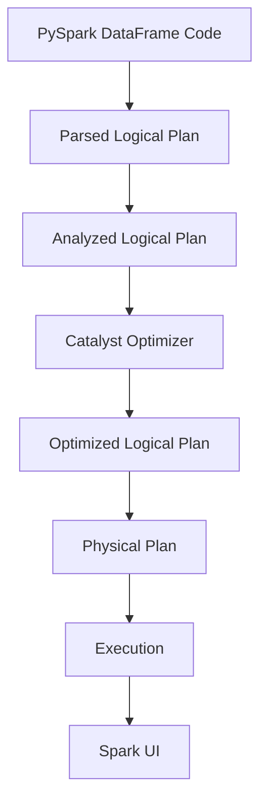

This connects Day 14 with Day 13.

---

# Part 3 - Logical Plans

## 3.1 Parsed Logical Plan

The Parsed Logical Plan represents what Spark understood from the user's code after parsing.

Example:

```python
df.filter(df.salary > 50000)
```

Conceptually:

```text
Filter
  salary > 50000
```

At this point, some references may still be unresolved.

Example from our CSV experiment:

```text
== Parsed Logical Plan ==
'Filter '`>`(salary#20, 50000)
+- Relation [...]
```

---

## 3.2 Analyzed Logical Plan

Spark resolves:

- Column names
- Schema
- Data types
- Expressions
- References to actual attributes

Our schema:

```text
employee_code: string
name: string
department: string
salary: integer
```

The analyzed plan understands:

```text
salary
   ↓
integer
```

Example:

```text
== Analyzed Logical Plan ==
employee_code: string,
name: string,
department: string,
salary: int

Filter (salary#20 > 50000)
+- Relation [...]
```
### Logical Plan vs Physical Plan

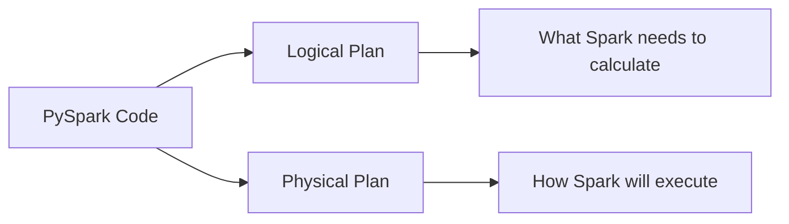

### Mental model

```text
Parsed
  ↓
What did the user write?

Analyzed
  ↓
Does Spark understand it?

Optimized
  ↓
Can Spark make it more efficient?

Physical
  ↓
How will Spark execute it?
```

---

# Part 4 - Optimized Logical Plan & Catalyst

## 4.1 What is the Optimized Logical Plan?

Spark examines the logical plan and tries to make it more efficient before selecting the physical execution strategy.

Examples observed during Day 14:

- Null handling
- Column pruning
- Predicate pushdown
- Removing unnecessary work
- Transforming the plan into a more efficient form

### Four Explain Plan Representations

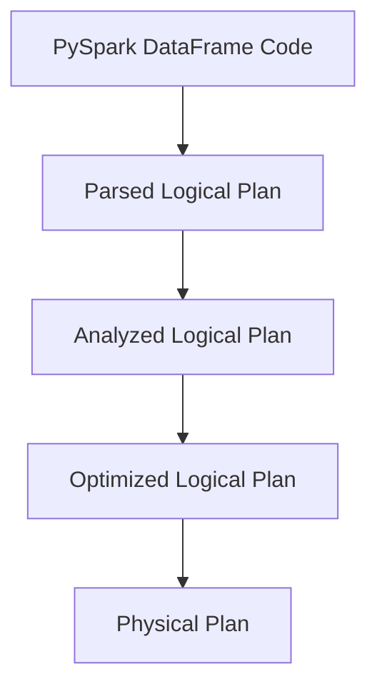

---

## 4.2 Catalyst Optimizer

**Catalyst** is Spark SQL's query optimization framework.

A useful mental model is:

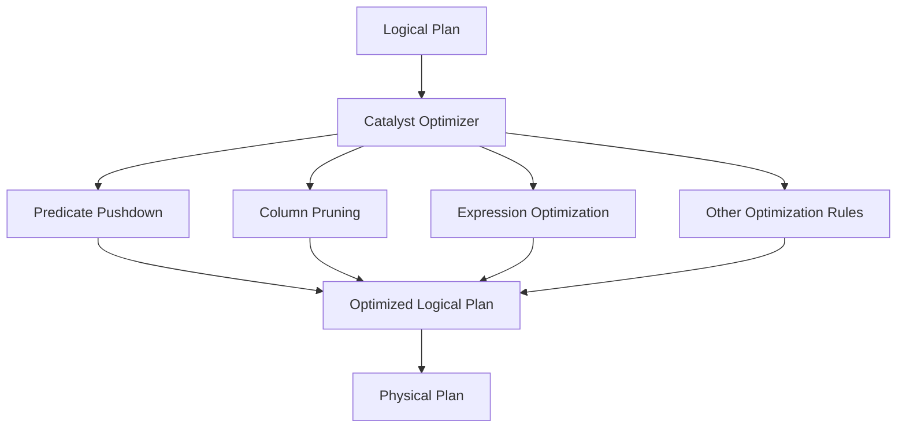

Catalyst applies optimization rules to transform the query plan.

We do not need to memorize Spark's internal implementation details.

### Key idea

Catalyst asks questions such as:

```text
Which rows are required?
Which columns are required?
Can an operation be simplified?
Can filtering happen earlier?
Does the operation require data redistribution?
Which physical operators should be used?
```

---

# Part 5 - Predicate Pushdown & Column Pruning

## 5.1 Predicate Pushdown

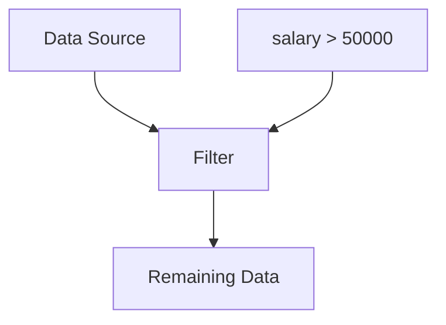

A predicate is a filtering condition.

Example:

```python
df.filter(df.salary > 50000)
```

Predicate:

```text
salary > 50000
```

Predicate pushdown means Spark tries to push the filter as close to the data source as possible.

Conceptually:

```text
Without pushdown

Data Source
     ↓
Read data
     ↓
Filter
     ↓
Result
```

With pushdown:

```text
Data Source
     ↓
Filter as early as possible
     ↓
Remaining data
```

Benefits can include:

- Less data processing
- Less I/O
- Less memory usage
- Less network transfer

### Actual experiment

```python
filtered_df = df.filter(df.salary > 50000)
filtered_df.explain(True)
```

We observed:

```text
PushedFilters:
[
    IsNotNull(salary),
    GreaterThan(salary,50000)
]
```

The optimized logical plan also added:

```text
isnotnull(salary)
```

because `salary` was nullable.

### Important distinction

```text
PushedFilters
    ≠
Guaranteed physical reduction at storage level
```

Whether the source can actually exploit the pushed filter depends on the data source.

---

## 5.2 Column Pruning

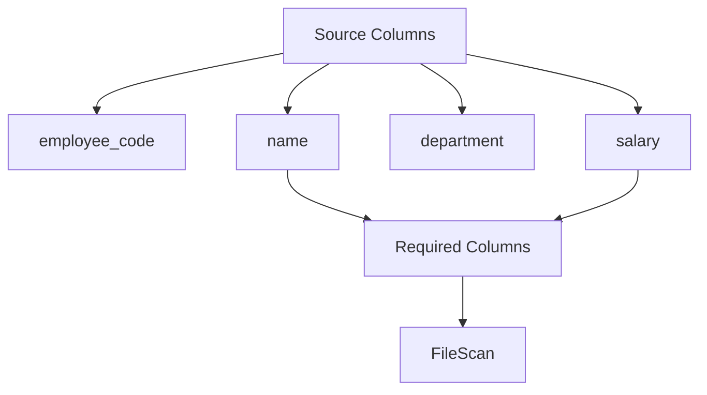

Column pruning means Spark reads only the columns required by the query.

Example:

```python
df.select("name", "salary")
```

Original schema:

```text
employee_code
name
department
salary
```

Required:

```text
name
salary
```

Physical plan:

```text
FileScan csv [name#18,salary#20]
```

Spark therefore avoids requesting:

```text
employee_code
department
```

### Mental model

```text
Original columns
       ↓
Determine required columns
       ↓
Prune unnecessary columns
       ↓
Read only required columns
```

Column pruning is particularly powerful with columnar formats such as **Parquet**.

---

# Part 5.3 - Filter + Select

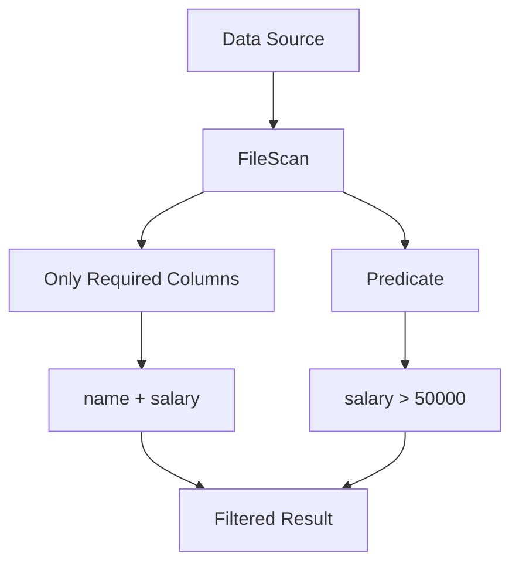

We tested:

```python
result_df = (
    df
    .filter(df.salary > 50000)
    .select("name", "salary")
)

result_df.explain(True)
```

The physical plan showed:

```text
Filter
   ↓
FileScan csv [name#18,salary#20]
```

and:

```text
PushedFilters:
[
    IsNotNull(salary),
    GreaterThan(salary,50000)
]
```

Therefore Spark achieved two important optimizations:

```text
Filter
  ↓
Predicate Pushdown

Select
  ↓
Column Pruning
```

### Important observation

A DataFrame operation does not necessarily map one-to-one to a physical operator.

Spark may satisfy a logical `Project` directly through the `FileScan`.

---

# Part 5.4 - Logical Plan vs Physical Plan

This is one of the most important concepts from Day 14.

## Logical Plan

> **WHAT Spark needs to calculate**

Example:

```text
Filter
salary > 50000
```

## Physical Plan

> **HOW Spark will execute it**

Example:

```text
FileScan
   ↓
Filter
```

Mental model:

```text
Logical Plan
     ↓
WHAT?

Physical Plan
     ↓
HOW?
```

---

# Part 5.5 - Physical Plan Operators

Common physical operators we started recognizing:

```text
FileScan
Filter
Project
Exchange
Sort
HashAggregate
```

Do not memorize every operator yet.

Instead, learn to ask:

> What does this operator mean in the execution?

---

# Part 5.6 - `Exchange`

`Exchange` is one of the most important physical-plan operators for a Data Engineer.


Definition:

> **`Exchange` represents redistribution of data between partitions.**

When we ran:

```python
df.repartition(4).explain(True)
```

we observed:

```text
Exchange RoundRobinPartitioning(4)
```

Conceptually:

```text
Current partitions
       ↓
    Exchange
       ↓
Redistributed data
       ↓
4 partitions
```

---

## Why does `repartition()` cause Exchange?

```python
df.repartition(4)
```

### Repartition → Spark UI

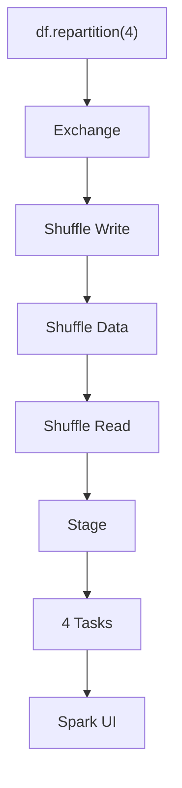

explicitly asks Spark to redistribute the data into four partitions.

Therefore Spark needs to move data between partitions.

```text
repartition(4)
      ↓
Data redistribution
      ↓
Exchange
      ↓
Shuffle
```

---

## Round-Robin Partitioning

Our physical plan contained:

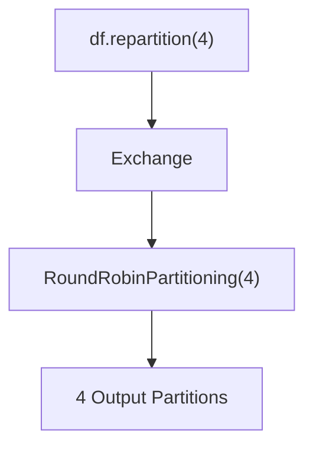

Conceptually:

```text
Row 1 → Partition 0
Row 2 → Partition 1
Row 3 → Partition 2
Row 4 → Partition 3
Row 5 → Partition 0
...
```

The purpose is approximately even distribution across the requested partitions.

---

# Part 5.7 - Exchange → Shuffle → Spark UI

This was the main practical connection between Day 13 and Day 14.

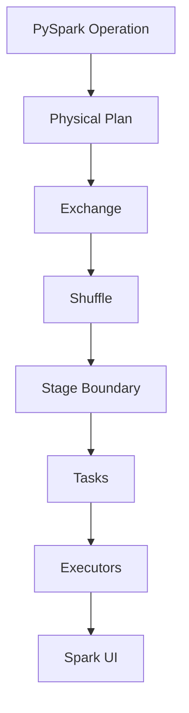

We executed:

```python
repartitioned_df = df.repartition(4)
repartitioned_df.count()
```

In Spark UI we observed shuffle metrics.

The important relationship was:

```text
Stage 2
Shuffle Write = 216 B
       ↓
Shuffle data
       ↓
Stage 4
Shuffle Read = 216 B
```

And later:

```text
Stage 4
Shuffle Write = 236 B
       ↓
Shuffle data
       ↓
Stage 7
Shuffle Read = 236 B
```
### Shuffle Data Flow

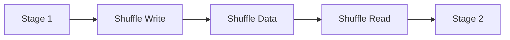

### Important lesson

A Spark application can contain **multiple shuffle boundaries**.

Do not assume:

```text
One action = one shuffle
```

or:

```text
One Exchange = entire application's only shuffle
```

---

# Part 5.8 - Tasks and Partitions

A useful rule:

> **One task generally processes one partition for a stage.**

Our `repartition(4)` experiment produced a stage with:

```text
4 tasks
```

because the repartition operation requested:

```text
4 output partitions
```

Conceptually:

```text
4 partitions
     ↓
4 tasks
```

Do not assume that every stage in every job must have the same number of tasks.

Different stages can have different partition counts.

---

# Part 5.9 - Why Shuffle Is Expensive

Shuffle can involve:

- Data redistribution
- Network transfer
- Serialization
- Deserialization
- Disk I/O
- Memory pressure
- Additional execution stages/tasks

Conceptually:

```text
Executor A
    │
    │ data movement
    ↓
Network / Shuffle
    │
    ↓
Executor B
```

Therefore:

> **Unnecessary shuffle should generally be avoided.**

Not every shuffle is bad or avoidable; many distributed operations inherently require it.

---

# Part 5.10 - AQE Introduction

Our physical plan also showed:

```text
AdaptiveSparkPlan isFinalPlan=false
```

This tells us that **Adaptive Query Execution (AQE)** is active.

For now, the mental model is:

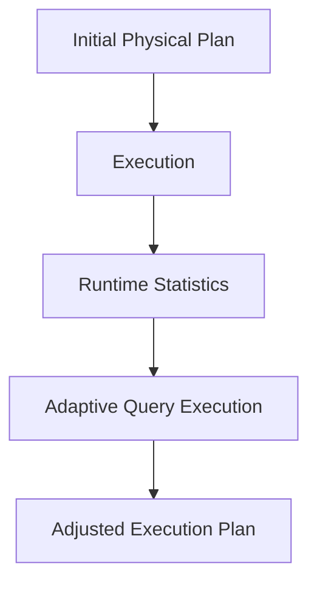

We will study AQE in more detail later.

---

# Day 14 - What We Completed

By the stopping point of Day 14, we covered:

- [x] `explain()`
- [x] `explain(True)`
- [x] Parsed Logical Plan
- [x] Analyzed Logical Plan
- [x] Optimized Logical Plan
- [x] Physical Plan
- [x] Logical Plan vs Physical Plan
- [x] Catalyst Optimizer — conceptual understanding
- [x] Predicate Pushdown
- [x] Column Pruning
- [x] Filter + Select optimization
- [x] Physical Plan operators
- [x] `Exchange`
- [x] `repartition(4)`
- [x] RoundRobinPartitioning
- [x] Exchange → Shuffle → Stage → Tasks
- [x] Verified shuffle using Spark UI
- [x] Basic introduction to AQE

---

# Day 14 - Key Mental Model

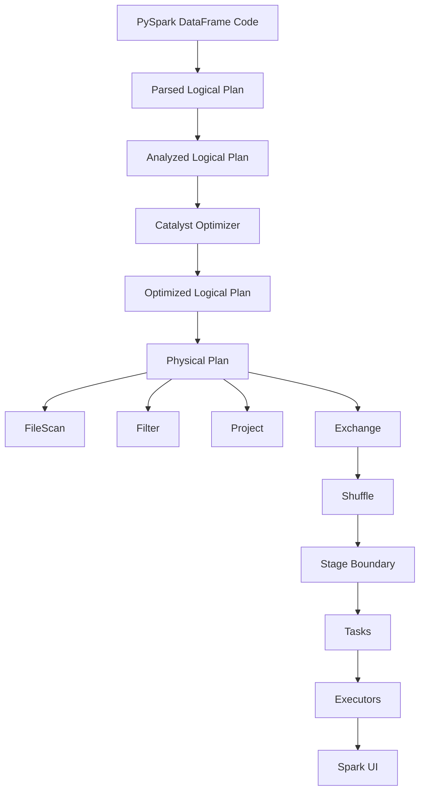

---

# Day 14 - Interview Questions

1. What does `explain()` do?
2. What is a Logical Plan?
3. What is an Analyzed Logical Plan?
4. What is an Optimized Logical Plan?
5. What is a Physical Plan?
6. What is the difference between Logical Plan and Physical Plan?
7. What is Catalyst Optimizer?
8. What is Predicate Pushdown?
9. What is Column Pruning?
10. What is an `Exchange` operator?
11. Why does `repartition()` cause an Exchange?
12. What is `RoundRobinPartitioning`?
13. How can you identify a shuffle using `explain()`?
14. How do you verify a shuffle in Spark UI?
15. Why is shuffle expensive?
16. What is AQE?
17. Why doesn't one DataFrame operation necessarily correspond to one physical operator?
18. Why is understanding the physical plan important for a Data Engineer?

---

# Day 15 - Part 6: `groupBy()` → HashAggregate → Exchange → Shuffle

The next session will start here.

## Objective

Understand why `groupBy()` requires data redistribution and how Spark performs distributed aggregation efficiently.

---

## 1. `groupBy()` Execution Plan

Start with:

```python
grouped_df = df.groupBy("department").count()

grouped_df.explain(True)
```

Expected conceptual pattern:

```text
FileScan
   ↓
Partial HashAggregate
   ↓
Exchange
   ↓
Final HashAggregate
```

---

## 2. Why does `groupBy()` require a shuffle?

Example:

```text
Partition 0
HR
IT

Partition 1
SALES
HR

Partition 2
IT
HR
```

The same key can exist in multiple partitions.

To calculate:

```text
HR    → total count
IT    → total count
SALES → total count
```

Spark needs the same grouping key to be brought together.

```text
Different partitions
       ↓
Exchange
       ↓
Same keys together
       ↓
Final aggregation
```

---

## 3. Hash Partitioning

Unlike:

```text
repartition(4)
```

which produced:

```text
RoundRobinPartitioning(4)
```

`groupBy("department")` can produce:

```text
hashpartitioning(department, 200)
```

The purpose is:

```text
department
     ↓
hash(department)
     ↓
Destination partition
```

Therefore all records for the same grouping key are sent to the same partition.

---

## 4. Partial HashAggregate

Spark can perform local aggregation before the shuffle.

Example:

```text
Partition 0
HR
HR
IT
```

can become:

```text
HR → 2
IT → 1
```

before the shuffle.

This reduces the amount of data that needs to be shuffled.

---

## 5. Final HashAggregate

After the shuffle:

```text
Partial results
       ↓
Exchange / Shuffle
       ↓
Same keys together
       ↓
Final HashAggregate
```

The final aggregation combines the partial results.

---

## 6. Key Physical Plan

The Day 15 starting point is:

```text
AdaptiveSparkPlan
       ↓
Final HashAggregate
       ↓
Exchange
hashpartitioning(department, 200)
       ↓
Partial HashAggregate
       ↓
FileScan
department only
```

---

## 7. Questions for Day 15

1. Why does `groupBy("department")` require an Exchange?
2. Why does Spark use hash partitioning for grouped data?
3. What is the purpose of Partial HashAggregate?
4. What is the purpose of Final HashAggregate?
5. Why can `groupBy()` reduce shuffle volume using partial aggregation?
6. What is the difference between `RoundRobinPartitioning` and `hashpartitioning`?
7. Why can input partition count and shuffle partition count be different?
8. What is controlled by `spark.sql.shuffle.partitions`?
9. How does the `groupBy()` Exchange appear in Spark UI?
10. How does the physical plan connect to shuffle read/write metrics?

---

# Day 15 - Remaining Topics

After `groupBy()`:

```text
Part 6
groupBy() + HashAggregate + Shuffle
        ↓
Part 7
repartition() vs coalesce()
        ↓
Part 8
WholeStageCodegen
        ↓
Part 9
Adaptive Query Execution (AQE)
        ↓
Part 10
Connect explain() + Spark UI
        ↓
Part 11
Day 15 interview questions
```

---

# Day 14 Completion Status

**Status: Completed up to Exchange and Spark UI verification.**

The next learning point is intentionally moved to **Day 15 Part 6** so that Day 14 does not become overloaded.

> **Day 14 takeaway: `explain()` tells us how Spark plans the work; Spark UI shows us what actually happened during execution.**
